# 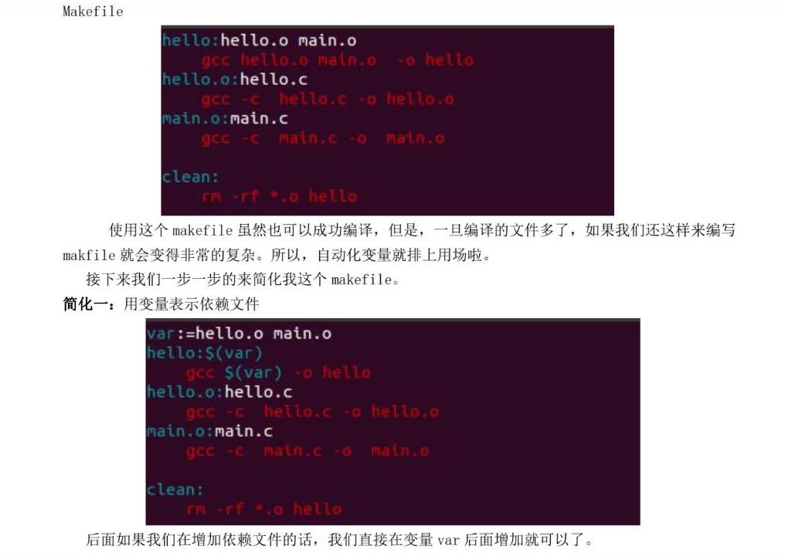Linux发行版

Linux发行版是基于 Linux 内核构建的完整操作系统集合。对你做嵌入式开发、RTOS 学习来说，理解发行版的结构、差异点和典型使用场景会帮助你更好地选择合适的工具链、构建系统和开发环境。

下面从体系架构、主要类型、关键差异点和嵌入式方向常用发行版几个维度做一个系统性讲解。

------

## 1. 什么是 Linux 发行版


Linux 本质只有一个核心组件：Linux 内核。
 但一个可用的操作系统需要更多内容，例如:

- GNU 工具链 (glibc、gcc、make 等)
- 包管理系统
- 桌面环境 (GNOME、KDE)
- 初始化系统 (systemd、SysVinit)
- 应用程序软件库
- 系统配置、驱动、文档

某个团队把这些东西组合、维护、打包、提供升级渠道，这就构成了所谓 “Linux 发行版”。
 因此不同的发行版差别在于：理念、包管理器、软件版本策略、更新方式等。

------

## 2. Linux 发行版主要分类

### 2.1 通用桌面和服务器发行版

面向普通用户、企业服务器等，特点是功能齐全、稳定性强。

- **Ubuntu**
   Debian 衍生最广泛的发行版，易用性好，社区强大。嵌入式常做开发主机。
- **Debian**
   稳定著称，软件经严格测试。**企业服务器**常用。
- **Fedora**
   最新技术试验田，来自 Red Hat 社区。
- **CentOS / Rocky Linux / AlmaLinux**
   面向**企业服务器**的稳定发行版，Red Hat 生态。
- **openSUSE**
   工具链强，适合集成测试。

### 2.2 滚动更新发行版

软件始终最新。

- **Arch Linux**
   KISS（保持简单）理念，滚动更新，学习成本高但灵活。
- **Manjaro**
   Arch 的衍生，更易安装。

### 2.3 专注轻量级与旧设备

对低资源设备友好。

- **Lubuntu / Xubuntu**
   Ubuntu 的轻量桌面版本。
- **Puppy Linux**
   占用极小。

------

## 3. 嵌入式和交叉编译相关发行版（重点）

在嵌入式开发领域，使用 Linux 发行版主要是作为“开发主机”，但也有一些发行版专门用于 Linux 嵌入式系统本身的构建。

### 3.1 用于开发主机（适合交叉编译环境）

- **Ubuntu**（最常用）
- **Debian**
- **Fedora**

原因是：
 包管理器稳定，ARM 工具链（gcc-arm-none-eabi、ARM cross GCC）安装方便，社区教程丰富。

### 3.2 面向嵌入式系统的发行版（不是开发主机，而是给设备跑的）

- **Yocto Project（Poky）**
  - 不是发行版，而是“构建发行版的工具链”。高度定制化，可裁剪到非常小。
  - 嵌入式企业广泛使用（NXP、TI、瑞萨的 BSP 基本都基于 Yocto）。
- **Buildroot**
  - 更简单轻便的嵌入式 Linux 构建系统。
  - 适合中小型项目，无需复杂的可重复构建策略。
- **OpenWrt**
  - 专门用于路由器、网络设备。
  - 包管理 opkg，非常轻量。
- **Armbian**
  - 针对 ARM SBC（树莓派、Rockchip、Allwinner）的发行版，适合作为嵌入式 Linux 原型开发系统。

------

## 4. 发行版之间的核心差异点

### 4.1 包管理器

Linux 发行版的最大区别在包管理工具：

| 发行版        | 包管理器      | 包格式      |
| ------------- | ------------- | ----------- |
| Debian/Ubuntu | apt、dpkg     | .deb        |
| CentOS/RHEL   | yum、dnf、rpm | .rpm        |
| Arch          | pacman        | pkg.tar.zst |
| openSUSE      | zypper        | .rpm        |
| Alpine        | apk           | .apk        |

嵌入式系统里（Yocto/Buildroot）则生成 rootfs，常不使用上述包管理系统。

### 4.2 软件稳定 vs 新旧程度

- Debian、CentOS：追求稳定
- Ubuntu：平衡稳定与新特性
- Fedora、Arch：软件最新

嵌入式通常偏向稳定版本。

### 4.3 初始化系统（init system）

大部分发行版使用 systemd，少部分使用 OpenRC 等。
 例如 Alpine Linux 使用 OpenRC，这让它特别轻量。

------

## 5. 如果你是嵌入式初学者，应该选哪一个

作为你的用途（STM32、FreeRTOS、Linux 编程、交叉编译）：

### 开发主机：Ubuntu（强烈推荐）

理由：

- GCC 工具链最容易安装
- 大量教程默认使用 Ubuntu
- Yocto 和 Buildroot 也优先支持 Ubuntu
- VSCode、CLion 等工具支持好

### 学习嵌入式 Linux 构建系统：

- 初级：Buildroot
- 中高级：Yocto Project

------

## 6. 建议的学习路径

1. 基于 Ubuntu 学习 Linux 基本命令、shell、Makefile、git。
2. 安装 ARM 交叉编译工具链并编译简单裸机程序。
3. 使用 Buildroot 构建简单的 rootfs（学习 Linux 从零构建原理）。
4. 学习 Yocto Project（企业级嵌入式构建系统）。
5. 运行 BusyBox、小型 rootfs 在开发板上。

------

如果你需要，我可以提供：

- 各发行版对比表（定量指标）
- Ubuntu 最佳开发环境配置方案
- Yocto 和 Buildroot 入门到进阶路线图
- 一套适合你目前水平的学习路线

你想继续深入哪个方向？

# Linux网络模式

针对你截图中的三种虚拟机网络模式，下面提供一个面向工程实践的、可直接用于嵌入式开发或 Linux 虚拟机调试的清晰说明。

------

## 1. 桥接模式 Bridge

核心含义：虚拟机像一台**真实的独立电脑**接入你的物理网络。

网络拓扑上，相当于主机和虚拟机都直接连到**同一个交换机**。

特征

1. 虚拟机从局域网 DHCP 服务器获取一个**独立局域网 IP**。
2. 虚拟机可以被局域网内的其他设备直接访问（例如你的手机、其它电脑、局域网服务器等）。
3. 网络发现、局域网共享、局域网调试最方便。

使用场景

1. 虚拟机需要与局域网设备互通（如局域网开发板、调试板）。
2. 想让局域网中其它机器访问虚拟机提供的服务，例如：
   - TFTP/FTP/NFS 服务器
   - ROS、MQTT 等局域网通信
   - SSH 登陆虚拟机
3. 在企业网中使用虚拟机作为独立节点。

风险点

1. 有些公司或校园网络禁止未知 MAC 地址加入网络，桥接模式可能被屏蔽。
2. 虚拟机暴露在外部网络风险更高。

------

## 2. NAT 模式（默认最常用）

核心含义：虚拟机通过**主机共享网络**上网，虚拟机相当于在主机后面再挂一层**私有网络**。

主机相当于给虚拟机做**路由器**。

特征

1. 虚拟机会获得一个来自虚拟 NAT 子网的私有 IP（如 192.168.56.x 或 10.0.x.x，由虚拟软件决定）。
2. 虚拟机可以访问外网。
3. 主机可以访问虚拟机，但需要端口映射或虚拟网卡支持。
4. 局域网中其他设备**不能主动访问虚拟机**。

使用场景

1. 学习 Linux、编译环境、正常上网。
2. 对虚拟机访问性要求不高，只需要 SSH 等主机访问虚拟机即可。
3. 不希望虚拟机暴露到真实网络，更安全。
4. 公司或校园网络禁止桥接 MAC 时。

NAT 是日常使用最“稳、简单、安全”的方式。

------

## 3. 主机模式 Host-only

核心含义：虚拟机与主机组成一个**完全隔离的局域网**，无法访问外网。

主机专门为虚拟机创建一张虚拟网卡，两者互通，但不会与外部网络通信。

特征

1. 虚拟机可以与主机互相访问（通常在 192.168.x.x 这类网段）。
2. **不能访问外网**（除非再加 NAT 适配器）。
3. 局域网其他设备也不能访问虚拟机。

使用场景

1. 调试服务器程序但不想让虚拟机连外网。
2. 做实验、抓包、搭建隔离网络、不想影响真实网络。
3. 嵌入式开发中，当你把主机当成虚拟机的上位机时（例如 TFTP/NFS server），但不希望虚拟机访问外网。

------

## 三种方式对比总结

| 模式      | 虚拟机是否能上网 | 虚拟机是否能被局域网访问 | 主机是否能访问虚拟机 | 场景                                   |
| --------- | ---------------- | ------------------------ | -------------------- | -------------------------------------- |
| 桥接      | 可以             | 可以                     | 可以                 | 虚拟机像独立主机，用于局域网调试、开发 |
| NAT       | 可以             | 不可以                   | 可以（较容易）       | 默认最适合一般学习开发                 |
| Host-only | 不可以           | 不可以                   | 可以                 | 隔离测试环境、完全与外部隔离           |

------

## 你的情况下推荐什么模式？

你在学嵌入式 Linux、Ubuntu、交叉编译、远程调试。根据经验：

如果你需要虚拟机作为 TFTP/NFS/SSH 目标被开发板访问
 使用 桥接模式。

如果你只是学习 Linux，不需要板子访问虚拟机
 使用 NAT 模式（方便、稳）。

如果你在做实验，不想虚拟机连外网
 使用 Host-only 模式。

------

如果你告诉我你正在做什么 Linux/嵌入式项目，我可以给你明确推荐哪个模式更合适。


# WMware虚拟机桥接模式连接不到网络 应该怎么配置?

## 打开虚拟网络编辑器

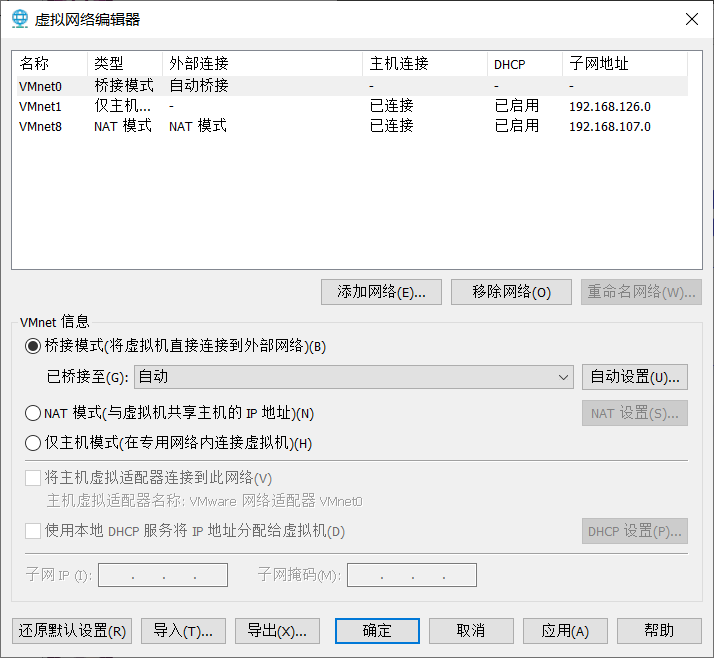

## 将桥接模式的自动，改为自己的网卡


## 这样网络就能成功连接


# Linux硬链接

在 Linux 文件系统中，**硬链接（hard link）\**是一个非常基础但又容易被误解的概念。结合你当前在做嵌入式 / Linux 底层学习，这一块一定要从\**inode 的视角**来理解。

------

## 一句话定义

**硬链接本质上是：多个文件名，指向同一个 inode。**

不是“复制文件”，而是**给同一个文件增加一个新的名字**。

------

## 一、从 inode 角度理解硬链接（关键）

Linux 文件系统里：

- **文件名** ≠ **文件本体**

- 文件的真正“身份”是 **inode**

- 目录的本质是：

  ```
  文件名  → inode 号
  ```

示意：

```
目录项
┌────────┬────────┐
│ fileA  │ inode42│
└────────┴────────┘

inode42
┌──────────────────┐
│ 权限 / 大小 / 数据│
└──────────────────┘
```

当你创建一个硬链接：

```
ln fileA fileB
```

结构变为：

```
目录项
┌────────┬────────┐
│ fileA  │ inode42│
│ fileB  │ inode42│
└────────┴────────┘
```

👉 **fileA 和 fileB 完全等价**

------

## 二、硬链接的核心特性（面试 / 实战重点）

### 1️⃣ 多个文件名，共享一个 inode

- inode 号相同
- 文件内容完全相同
- 权限、大小、时间戳完全一致

查看 inode：

```
ls -i fileA fileB
```

输出示例：

```
123456 fileA
123456 fileB
```

------

### 2️⃣ 删除其中一个，不影响另一个

```
rm fileA
```

- inode 仍然存在
- fileB 仍然可以正常访问数据

原因：

- inode 有一个 **link count（链接计数）**
- 只有当链接计数变为 0，inode 才会被释放

```
ls -l fileB
```

第二列数字就是 **硬链接数**

------

### 3️⃣ 修改任意一个，所有名字都“同时变化”

```
echo "hello" >> fileA
cat fileB
```

因为你改的是 **inode 对应的数据块**，不是文件名。

------

## 三、硬链接的限制（非常重要）

### ❌ 1. 不能跨文件系统

```
ln /mnt/u/fileA /home/fileB
```

失败原因：

- inode 只在**当前文件系统内有意义**
- 不同分区有不同 inode 空间

------

### ❌ 2. 不能对目录创建硬链接（普通用户）

```
ln dirA dirB
```

系统会拒绝。

原因（本质）：

- 防止目录结构出现环
- 否则会导致：
  - `.` / `..`
  - 递归遍历
  - fsck 无法修复

（只有 root 在某些特殊场景下可以，但你可以理解为“禁止”）

------

## 四、硬链接 vs 软链接（一定要对比理解）

| 对比项         | 硬链接             | 软链接（符号链接） |
| -------------- | ------------------ | ------------------ |
| 指向对象       | inode              | 路径字符串         |
| inode 是否相同 | 是                 | 否                 |
| 删除源文件     | 不受影响           | 失效（悬空链接）   |
| 跨文件系统     | ❌                  | ✅                  |
| 可链接目录     | ❌                  | ✅                  |
| 类似于         | “同一个人多个名字” | “快捷方式”         |

一句话区分：

> **硬链接是“同一个文件”，软链接是“指向文件的指针”。**

------

## 五、硬链接在系统中的真实例子

### 1️⃣ `/bin` 和 `/usr/bin` 中的工具

很多系统中：

```
ls -i /bin/busybox /usr/bin/busybox
```

可能 inode 相同。

目的：

- 节省磁盘空间
- 多路径兼容

------

### 2️⃣ 嵌入式 Linux 中的 BusyBox

```
/bin/ls
/bin/cp
/bin/mv
```

可能全部是 **同一个 busybox inode 的硬链接**。

BusyBox 内部通过：

```
argv[0]
```

判断当前“名字”，决定执行哪个命令。

------

## 六、一个常见误区（一定要纠正）

❌ 错误理解：

> 硬链接是文件的备份

✅ 正确理解：

> 硬链接是同一个文件的多个入口

**不存在“主文件”和“副本文件”之分**。

------

## 七、总结（记住这 4 句话就够了）

1. 硬链接 = 多个文件名指向同一个 inode
2. 删除任意一个名字，不会删除文件数据
3. inode 链接数为 0，文件才真正消失
4. 不能跨文件系统，不能链接目录

------

如果你愿意，下一步我可以结合：

- `stat` 命令逐字段拆 inode
- ext4 下 inode / dentry / page cache 的关系
- 或者用 **实际命令一步一步演示硬链接变化**

你可以直接告诉我你想从“原理”“命令”“嵌入式应用”哪个角度继续。

# 图中这个硬链接的创建是什么意思??

我刚学习到硬链接的知识 ，只知道它是一个指针
所以图中的命令 生成的test2.c是test1.c的指针吗??

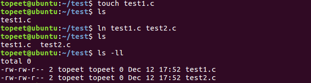

这是一个非常好的问题！刚接触硬链接（Hard Link）时，确实很容易和“指针”或“快捷方式”搞混。

简单直接的回答是：**test2.c 不是指向 test1.c 的指针，它们两个是完全平等的“双胞胎”。**

为了帮你彻底弄懂，我们需要纠正一下“指针”这个概念在文件系统中的理解。

### 1. 核心概念：什么是“文件”？

在 Linux 系统中，一个文件其实由两部分组成：

1. **数据本身**（存放在磁盘的具体位置，由 **inode** 索引节点管理）。
2. **文件名**（只是给这个 inode 起的一个别名，方便人看）。

### 2. 图解你的命令 ln test1.c test2.c

当你执行这个命令时，系统做了以下事情：

- **原本：** 磁盘上有一块数据（inode），它有一个名字叫 test1.c。
- **执行后：** 系统给这块**同一个数据（同一个 inode）** 又起了一个名字叫 test2.c。

**关键点来了：**

- **不要把它们想象成：** test2.c --> test1.c --> [数据] （这是软链接/符号链接的概念，也就是你理解的“指针”）。
- **实际上它们是：**
  - test1.c --> [数据/inode]
  - test2.c --> [数据/inode]

它们两个**地位完全平等**，都直接指向磁盘上的同一块数据。系统根本分不清哪个是原来的，哪个是后来的。

### 3. 用通俗的例子解释

想象一下，有一个人叫“张三”：

- **数据（inode）：** 也就是“张三”这个肉体凡胎的人。
- **文件名（test1.c）：** 这是他的“大名”，大家都叫他张三。
- **硬链接（test2.c）：** 这是他的“小名”，比如叫“小张”。

**问：** “小张”是指向“张三”这个名字的指针吗？
**答：** 不是。当你叫“小张”的时候，你叫的是那个人（肉体）；当你叫“张三”的时候，你叫的也是那个人（肉体）。如果你把“张三”这个名字注销了（删除了 test1.c），那个人还在吗？当然在，因为他还有个名字叫“小张”。

### 4. 看懂你的截图 ls -ll

请注意看你截图中 ls -ll 输出的这一列数字：

 code Text

downloadcontent_copy

expand_less


```
    -rw-rw-r--  2  topeet  topeet ... test1.c
-rw-rw-r--  2  topeet  topeet ... test2.c
            ^
            |
      注意这个数字
  
```

这个数字 **2** 叫做 **硬链接计数（Link Count）**。

- 
- 它的意思是：**“目前有两个文件名是指向这块数据的。”**
- 如果你再创建一个 ln test1.c test3.c，这三个文件的计数都会变成 3。

### 5. 硬链接的特点（验证是不是“指针”）

为了验证它们不是“指针”，你可以做两个实验（脑补一下结果）：

1. **修改内容同步：**
   如果你用编辑器打开 test2.c 并写入 "Hello World"，保存。
   当你打开 test1.c 时，你会发现里面也有 "Hello World"。因为它们根本就是**同一块数据**。
2. **删除源文件：**
   如果你执行 rm test1.c。
   - 如果是“指针”（软链接/快捷方式），test2.c 就会失效（报错找不到文件）。
   - **但是对于硬链接：** test2.c **依然完好无损**，内容也在。此时 ls -ll 查看 test2.c，那个计数数字 2 会变成 1。

### 总结

- **你理解的“指针”：** 在 Linux 里叫 **软链接（Symbolic Link）**，命令是 ln -s ...。那才是 B 指向 A，A 删了 B 就废了。
- **图中的硬链接：** 是**同一个文件的不同入口**。test2.c 是数据的另一个名字，不是 test1.c 的影子。

## 所以你的意思是 硬指针就是复制一个文件的意思吗

**千万别这么理解，这是一个非常危险的误区！**

“硬链接”和“复制（Copy）”表面上看都是多了一个文件，但本质上有 **天壤之别**。

区别在于：**修改后的后果** 和 **占用的空间**。

我用两个场景来对比，你就立刻明白了：

### 场景一：如果是“复制” (cp test1.c test2.c)

就像是你复印了一份作业：

1. **独立性：** 磁盘上会有 **两份** 独立的数据。
2. **修改：** 你在 test2.c 里乱涂乱画，test1.c **不会** 发生任何变化。
3. **空间：** 如果文件是 1GB，复制后就占用了 2GB 的磁盘空间。

------


### 场景二：如果是“硬链接” (ln test1.c test2.c) —— 即你图中的情况

就像是一个房间装了 **两个门**（前门和后门）：

1. **同一性：** 磁盘上始终只有 **一份** 数据。
2. **修改（最关键的区别）：**
   - 如果你打开 test2.c 修改了代码并保存。
   - 你再打开 test1.c，你会发现 **里面的内容也变了！**
   - **因为它们根本就是同一个文件，只是入口不同。**
3. **空间：** 无论你创建多少个硬链接，磁盘空间几乎 **不增加**（还是只占那一文件的空间）。

------


### 怎么验证？（教你一招必杀技）

在 Linux 中，每一个文件都有一个唯一的身份证号，叫 **Inode 编号**。

请你在终端里输入这个命令（加上 -i 参数）：

 code Bash

downloadcontent_copy

expand_less


```
    ls -li
  
```

你会看到类似这样的结果：

 code Text

downloadcontent_copy

expand_less


```
    123456  -rw-rw-r--  2 topeet topeet ... test1.c
123456  -rw-rw-r--  2 topeet topeet ... test2.c
^
|
看这里
  
```

- 
- **对于硬链接：** 你会发现 test1.c 和 test2.c 最前面的那个数字（Inode号） **是一模一样的**。这证明了它们是**同一个文件**。
- **对于复制的文件：** 这个数字绝对不一样。

### 总结

- **复制 (cp)** = 克隆羊多利（两只羊，你剪一只羊的毛，另一只不会秃）。
- **硬链接 (ln)** = 一个人有两个名字（还是这一个人，你叫“张三”让他理发，叫“小张”看他也是理了发的）。


## 所以 硬连接就是给一个文件起别名是吗

**完全正确！**

用 **“给文件起别名”** 来理解硬链接，是最精准、最通俗的方式。

不过，为了让你理解得更透彻，我需要强调这个“别名”的一个**特殊属性**：

### 这个“别名”和“原名”是完全平等的

通常我们在生活中说“别名”时，总觉得有一个是“真名”，另一个是“外号”。但在 Linux 的硬链接里：

- test1.c 是真名。
- test2.c **也是真名**。

**系统根本不区分哪个是先来的，哪个是后来的。**

------


### 用“银行联名账户”来比喻最贴切：

想象你有一个银行账户（这就是**文件数据**），你办了两张卡（一张卡叫 **test1.c**，一张卡叫 **test2.c**）：

1. **取钱（修改数据）：**
   你用 test2.c 这张卡取了 100 块钱，账户余额就变了。你再去查 test1.c，余额也少了 100 块。
   *(这就是：修改一个，另一个也会变)*
2. **剪卡（删除文件）：**
   你把 test1.c 这张卡剪了（删除了）。
   **问：** 账户里的钱丢了吗？
   **答：** 没有！因为你手里还有 test2.c 这张卡，你依然可以正常访问账户。
3. **什么时候钱真正没了？**
   只有当你把 **所有的卡（test1.c 和 test2.c）** 全都剪掉（删除）了，银行才会注销这个账户，把空间释放出来。

### 总结一下你的进阶理解：

- **是指针吗？** 不是。（指针是有方向的，A指向B，B没了A就废了）。
- **是复制吗？** 不是。（复制是两份钱，花一份不影响另一份）。
- **是别名吗？** **是！**（同一个账户，不同的卡）。

恭喜你，你已经完全掌握硬链接的本质了！

# Linux软连接

太棒了！因为你之前对“指针”的理解，现在学习**软链接（Symbolic Link）**会非常轻松。

还记得你最开始的问题吗？你问硬链接是不是指针。
答案是：**硬链接不是指针，但软链接就是你心里想的那个“指针”！**

------


### 1. 什么是软链接？

**软链接**（也叫符号链接），就是 Windows 系统里的 **“快捷方式”**。

它和硬链接完全不同：

- **硬链接：** 是文件的另一个名字（像“大名”和“小名”）。
- **软链接：** 是一个特殊的文件，它的肚子里存放的不是数据，而是**另一个文件的路径地址**。

### 2. 如何创建？

命令非常简单，就在 ln 后面加一个 -s (symbolic)：

 code Bash

downloadcontent_copy

expand_less


```
    ln -s test1.c test_soft.c
  
```

- test1.c 是源文件。
- test_soft.c 是生成的**软链接**（快捷方式）。

### 3. 图解软链接（ls -l 的样子）

如果你执行 ls -il（显示 inode 号和详细信息），你会看到非常明显的区别：

 code Text

downloadcontent_copy

expand_less


```
    123456  -rw-rw-r--  1 topeet topeet ... test1.c
987654  lrwxrwxrwx  1 topeet topeet ... test_soft.c -> test1.c
^       ^                                           ^
|       |                                           |
(1)    (2)                                         (3)
  
```

**大家来找茬（三个关键点）：**

1. **Inode 编号不同：**
   看最前面的数字（(1)），它们是不一样的！这说明 test_soft.c 是一个**全新的、独立的文件**。它不是 test1.c 的分身。
2. **文件类型是 l：**
   看权限那一列的第一个字母（(2)），是 **l** (link)，表示这是一个软链接文件。而普通文件是 -。
3. **箭头指示 ->：**
   文件名后面有一个箭头（(3)），明确告诉你：**我是指向 test1.c 的**。

### 4. 最核心的区别：如果源文件删了会怎样？

这是区分硬链接和软链接最直观的方法。

**情景：** 我们把源文件 test1.c 删掉 (rm test1.c)。

- **对硬链接来说：** test2.c 毫无影响，依然能看内容（因为它是“小名”，人还在）。
- **对软链接来说：** test_soft.c **立马废了！**
  - 它依然存在于磁盘上，但如果你尝试打开它，系统会报错：“No such file or directory”。
  - 这就叫 **“死链接” (Broken Link)**。就像你桌面的游戏快捷方式还在，但你把安装文件夹删了，快捷方式就打不开游戏了。

### 5. 为什么有了硬链接，还需要软链接？

既然硬链接那么稳（删源文件都不怕），为啥还要软链接？因为硬链接有两个巨大的**弱点**，而软链接正好解决了：

1. **硬链接不能跨分区/跨文件系统：**
   如果你有一个文件在 C 盘，你不能在 D 盘创建一个它的硬链接。因为 Inode 编号只在同一个分区内唯一。
   **但是软链接可以！** 就像你的桌面（C盘）可以放一个 D 盘文件的快捷方式。
2. **硬链接不能链接“目录”（文件夹）：**
   Linux 系统为了防止混乱，通常不允许给目录创建硬链接。
   **但是软链接可以！** 你可以给一个很深的目录创建一个软链接放在桌面，双击直接进去。

### 总结一张表

| 特性           | 硬链接 (Hard Link)            | 软链接 (Soft Link)                      |
| -------------- | ----------------------------- | --------------------------------------- |
| **命令**       | ln 源 目标                    | ln -s 源 目标                           |
| **本质**       | 同一个文件的别名 (Inode 相同) | 一个指向源文件路径的新文件 (Inode 不同) |
| **我是谁**     | 我就是源文件本身              | 我是源文件的“快捷方式”/“指针”           |
| **删除源文件** | **没事**，链接依然可用        | **失效** (Broken Link)                  |
| **跨分区**     | 不可以                        | **可以**                                |
| **链接目录**   | 不可以                        | **可以**                                |

**一句话总结：**

- **硬链接**是备份和别名（防误删）。
- **软链接**是快捷方式（方便访问）。

# Linux文件颜色

这是一个非常敏锐的观察！Linux 里的五颜六色并不是为了“好看”，而是一种**视觉辅助系统**。

它的作用是：**让你不用看详细属性（不用敲 ls -l），光看颜色就能一眼分辨出它是什么类型的文件，或者有什么特殊权限。**

这些颜色通常是由 ls 命令配合配置显示的（Ubuntu 默认就有）。下面是 Linux 终端中最常见的**颜色代码表**（以此为准，虽然不同主题可能微调，但大体通用）：

### 1. 最常见的几种颜色（必须记住）

- **⚪️ 白色 / 灰色 (White)**
  - **含义：** **普通文件**。
  - **例子：** 你的 test1.c、文本文件 .txt、配置文件等。
  - **状态：** 最平常的文件，没什么特殊的。
- **🔵 蓝色 (Blue)**
  - **含义：** **目录 (Directory/文件夹)**。
  - **例子：** /home、/usr、或者你创建的文件夹。
  - **记忆口诀：** 像大海一样包容万物。
- **🟢 绿色 (Green)**
  - **含义：** **可执行文件 (Executable)**。
  - **例子：** 它可以是一个脚本（.sh），也可以是一个编译好的程序（比如 a.out）。
  - **意味着：** 你可以直接运行它（输入 ./文件名）。
- **🔵 青色 / 天蓝色 (Cyan)**
  - **含义：** **软链接 (Symbolic Link)**。
  - **例子：** 就是我们刚才讲的“快捷方式”。
  - **关联知识：** 当你看到青色的文件，你就知道它背后指向了别的地方。
- **🔴 红色 (Red)**
  - **含义：** **压缩包 / 归档文件**。
  - **例子：** .tar, .gz, .zip, .rar 等。
  - **作用：** 提醒你这是一个包裹，需要解压才能看。

### 2. 特殊且具有警示意义的颜色（进阶）

- **🔴 红色闪烁 / 红色背景：**
  - 
  - **含义：** **断裂的软链接 (Broken Link)**。
  - **情景：** 刚才说的，你把源文件删了，剩下的那个软链接就会变红，或者在那一闪一闪的。
  - **警示：** 告诉你“这个快捷方式废了，别点了”。
- **🟤 紫色 / 洋红色 (Magenta)**
  - **含义：** **图片或多媒体文件**。
  - **例子：** .jpg, .png, .mp3 等（有的系统配置里，socket文件也是这个颜色）。
- **🟡 黄色 / 橙色背景 (Yellow)**
  - **含义：** **设备文件 (Device)**。
  - **例子：** /dev/sda (硬盘), /dev/tty (终端)。通常在 /dev 目录下见到。
- **🟩 绿色背景 + 黑色文字：**
  - **含义：** **权限很开放的目录**。
  - **例子：** 比如 /tmp 目录。这意味着“任何人（World）都可以在这里写数据”，通常叫 Sticky Bit 权限。

### 3. 如何验证或修改？

这些颜色其实是由一个环境变量控制的，叫 LS_COLORS。

你可以做一个小实验：

1. 
2. 输入 ls，你会看到彩色的文件。
3. 输入 \ls (在前面加个反斜杠) 或者 /bin/ls，你会发现颜色**消失了**，全变成了黑白！

**为什么？**
因为你平时用的 ls 其实是一个“别名”（Alias）。系统默认帮你把：
ls 变成了 ls --color=auto。

你可以输入这个命令查看：

 code Bash

downloadcontent_copy

expand_less


```
    alias ls
  
```

通常会输出：alias ls='ls --color=auto'。

### 总结

当你下次在一个目录下 ls 时：

- 看到 **蓝色** ➡️ 它是**文件夹**，可以 **cd 进去**。
- 看到 **绿色** ➡️ 它是**程序**，可以 **./ 运行它**。
- 看到 **天蓝色** ➡️ 它是**软链接（快捷方式）**。
- 看到 **红色** ➡️ 它是**压缩包**。
- 看到 **红色闪烁** ➡️ 它是**坏掉的链接，快去修**！

# 不同类型的文件在查看时 其开头的字符分别是什么意思?


这个问题非常关键！这一个字符其实是文件的**“身份证类型”**。

在 ls -l 输出的那一长串乱码似的东西里（比如 -rw-rw-r--），**第 1 个字符**具有决定性的意义：它告诉系统（和你）**这到底是个什么东西**。

后面那 9 个字符（如 rw-rw-r--）是权限（谁能读、谁能写），而**第 1 个字符**专门代表 **文件类型**。

下面是 Linux 中最常见的 7 种文件类型标识：

### 1. 最常见的三个（必须掌握）

#### **- (普通文件 - Regular File)**

- **含义：** 这是最普通的文件。
- **包括：** 文本文件、代码文件（你的 test1.c）、图片、压缩包、二进制可执行程序等。
- **注意：** 刚才讲的 **硬链接**，因为它本质上就是那个文件本身，所以它的类型也是 **-**。

#### **d (目录 - Directory)**

- **含义：** 文件夹。
- **记忆：** **d** 是 **d**irectory 的首字母。
- **颜色：** 通常是蓝色。
- **例子：** 如果你执行 ls -ld /home，你会看到 drwxr-xr-x，那个 d 就代表它是个目录。

#### **l (软链接 - Link)**

- **含义：** 符号链接（软链接 / 快捷方式）。
- **记忆：** **l** 是 **l**ink 的首字母。
- **颜色：** 通常是天蓝色/青色。
- **特点：** 只有这种文件，后面才会有 -> 指向另一个文件。

------


### 2. 只有在 /dev 等特殊目录下常见的（硬件设备）

Linux 讲究“**一切皆文件**”，连硬盘、鼠标、键盘在系统里都被看作是文件。

#### **b (块设备 - Block Device)**

- **含义：** 存储数据的设备，数据是**一块一块**读写的。
- **例子：** 你的硬盘、U盘。
- **查看：** ls -l /dev/sda，你会看到 brw-rw----。那个 b 代表硬盘。

#### **c (字符设备 - Character Device)**

- **含义：** 串行设备，数据是**一个字符一个字符**流动的。
- **例子：** 键盘、鼠标、打印机、终端屏幕。
- **查看：** ls -l /dev/tty1，你会看到 crw--w----。

------


### 3. 高级进程通信用的（偶尔见到）

#### **s (套接字 - Socket)**

- **含义：** 用于程序之间的网络通信或本地通信。
- **例子：** 比如 MySQL 数据库运行时，会生成一个 .sock 文件。
- **颜色：** 通常是紫色。

#### **p (管道 - Pipe)**

- **含义：** 命名管道，用于让两个程序像接水管一样传递数据。
- **记忆：** **p** 是 **p**ipe 的首字母。

------


### 总结一张表

| 符号  | 英文全称             | 中文含义        | 例子/备注                         |
| ----- | -------------------- | --------------- | --------------------------------- |
| **-** | **Regular file**     | **普通文件**    | 代码、文本、程序 (硬链接也是这个) |
| **d** | **Directory**        | **目录/文件夹** | 存放其他文件的地方                |
| **l** | **Link**             | **软链接**      | 快捷方式 (Soft Link)              |
| **b** | **Block device**     | **块设备**      | 硬盘、U盘                         |
| **c** | **Character device** | **字符设备**    | 键盘、鼠标、串口                  |
| **s** | **Socket**           | **套接字**      | 进程间通信                        |
| **p** | **Pipe**             | **管道**        | 数据传输通道                      |

### 回到你最初的例子

codeBash

```
-rw-rw-r--  2  topeet ... test1.c
-rw-rw-r--  2  topeet ... test2.c
```

- 因为开头是 **-**，所以它们都是 **普通文件**。
- 哪怕 test2.c 是 test1.c 的硬链接，它依然被视为一个**普通的、独立的文件**，所以是 -。
- 如果是软链接，就会变成 lrwxrwxrwx ... test_soft -> test1.c，开头就是 **l** 了。

# 文件系统是什么??Linux为什么必须要挂载一个文件系统??


这两个问题触及了操作系统的灵魂。如果你弄懂了这两个概念，你对 Linux 的理解将超越 90% 的初学者。

我们一个一个来拆解。

------


### 第一部分：文件系统 (File System) 是什么？

#### 1. 为什么需要它？（举个通俗的例子）

想象你买了一个 **超大的仓库（硬盘）**，里面空荡荡的，什么都没有。
如果你直接把成千上万个货物（数据）扔进去：

- 你要找东西时怎么办？（没法找，全乱了）
- 这个货物多大？占了多少地方？（不知道）
- 哪里还有空位放新东西？（不知道）

**“文件系统”就是这个仓库的管理员 + 货架系统 + 账本。**

#### 2. 它的具体工作

当你对硬盘进行 **格式化（Format）** 时，其实就是在安装文件系统。它在光秃秃的硬盘上做了三件事：

1. **画格子（块/Block）：** 把硬盘切分成无数个小方格（通常是 4KB 一个格），这是存数据的最小单位。
2. **建索引（Inode）：** 我们之前讲的硬链接提到的 Inode，就是文件系统建立的一个“大账本”。它记录了每个文件在哪个格子里、多大、谁能读写。
3. **定规则：** 规定文件名最长多少字符？文件能不能加密？断电了数据会不会丢？

#### 3. 常见的种类

就像仓库的管理制度有不同的流派一样，文件系统也有很多种：

- **ext4：** Linux 最经典、最常用的文件系统（你的 Ubuntu 很可能就在用这个）。
- **NTFS：** Windows 默认的文件系统。
- **FAT32 / exFAT：** U盘常用的，兼容性好，但在存大文件和权限管理上比较弱。

**一句话总结：**
**文件系统是把“物理的磁盘”变成“逻辑的文件和目录”的一套管理软件。** 没有它，硬盘就是一块废铁。

------


### 第二部分：Linux 为什么必须要“挂载 (Mount)”？

这是 Linux 和 Windows 思维方式最大的不同点。

#### 1. Windows 的思维：各自为政（盘符制）

在 Windows 里，每个分区（硬盘）都是一个独立的地盘：

- C盘是 C盘的树。
- 插个 U盘，变成了 D盘（D:\），它是另一棵树。
- 再接个移动硬盘，变成 E盘（E:\）。

它们是**并列关系**，互不干扰。

#### 2. Linux 的思维：天下一统（单根树状结构）

Linux 讲究 **“大一统”**。在 Linux 的世界里，**只有一棵树**，根节点就是 **/ (根目录)**。

不管你有多少块硬盘、多少个 U盘，它们必须都挂在这唯一的一棵树上，作为这棵树的一个“树枝”或者“叶子”才能被访问。

#### 3. 什么是“挂载”？（核心图解）

**挂载（Mount）** 就是把一个**物理设备**（比如 U盘），“嫁接”到这棵树的某个**目录**上的过程。

**举个场景：**
假设你插入了一个 U盘，系统识别为设备文件 /dev/sdb1（这是个黄色的设备文件，还记得吗？）。
此时，你无法直接进入 /dev/sdb1，因为它是个“块设备”，不是文件夹。

你需要做三步：

1. **找个“门”（创建目录）：**
   我们在 /mnt 下建个文件夹叫 usb。
   mkdir /mnt/usb
   *(此时这个文件夹是空的，它是系统根分区的一部分)*
2. **挂载（开门）：**
   执行命令：mount /dev/sdb1 /mnt/usb
   *这句话的意思是：**把 U盘的内容，覆盖显示在 /mnt/usb 这个目录下。***
3. **访问：**
   现在你进入 /mnt/usb，看到的不再是空的目录，而是 U盘里的文件了！

#### 4. 为什么要这样设计？

你可能会觉得：“Windows 自动出 D盘多方便啊，Linux 为什么要这么麻烦？”

其实 Linux 的设计在服务器领域更具优势：

1. **统一视图：** 无论你加了多少块硬盘，对于程序来说，路径永远是 /data 或 /home，程序不需要改代码（不用管是 D盘还是 E盘）。
2. **灵活扩容：** 假设你的 /home 目录空间不够了。在 Linux 里，你可以买块新硬盘，直接把它挂载到 /home 位置上，瞬间空间就变大了，而对用户来说，路径完全没变。
3. **安全性：** 你可以把一个只读的光盘挂载上去，指定为“只读模式”，谁也别想改里面的数据。

### 总结

- **文件系统** = **仓库管理员**。它把原本杂乱无章的磁记录变成了井井有条的文件和目录。
- **挂载** = **开门/嫁接**。因为 Linux 只有一棵目录树（/），所有的外部存储设备（硬盘、U盘、光盘）都必须通过“挂载”这个动作，变成这棵树下的一个子目录，你才能进去看里面的东西。

# gcc

这是一个非常经典的问题！

如果说 **Linux 内核** 是汽车的**引擎**，那么 **GCC** 就是制造这台引擎的**机床**。没有 GCC，就没有现在的 Linux 世界。

简单来说，**GCC (GNU Compiler Collection)** 是一个**“超级翻译官”**。

### 1. 为什么需要 GCC？（通俗理解）

- **你写的代码 (test1.c)：** 是给**人**看的（C语言）。
- **CPU 能懂的代码 (二进制 0101)：** 是给**机器**看的。

CPU 根本看不懂 printf("Hello") 是什么意思。GCC 的工作就是**把你写的 C 语言代码，翻译成 CPU 能听懂的二进制指令**（也就是那个绿色的可执行文件）。

### 2. 最简单的用法

假设你有一个 test1.c 文件。

**用法 1：最懒的用法**

 code Bash

downloadcontent_copy

expand_less


```
    gcc test1.c
  
```

- 结果：GCC 会默默地生成一个叫 a.out 的绿色文件。
- 运行：./a.out

**用法 2：指定名字 (推荐)**

 code Bash

downloadcontent_copy

expand_less


```
    gcc test1.c -o myapp
  
```

- **-o** 的意思是 **Output (输出)**。
- 结果：生成一个叫 myapp 的绿色文件。
- 运行：./myapp

------


### 3. 进阶：GCC 到底干了什么？（核心知识）

很多初学者以为 gcc test1.c 是一步到位的。其实，GCC 在后台偷偷干了 **4 件事**（这在面试或嵌入式开发中经常问）：

GCC 把“原材料”变成“成品”的过程，就像做菜一样：

#### **第一步：预处理 (Preprocessing)**

此时编译器会对头文件或者宏定义进行展开，或者条件编译的选择

- **命令参数：** **-E**(只对文件进行预处理，不编译和链接)
- **做什么：** 把代码里的“准备工作”做好。
  - 把 #include <stdio.h> 里的内容真的搬过来。
  - 把注释 // 这是一个测试 删掉（CPU 不需要看注释）。
  - 把宏定义 #define 替换掉。
- **结果：** 生成**.i文件**，还是 C 代码，但是变长了，变干净了。

#### **第二步：编译 (Compilation)**

此时编译器会把文件编译成**汇编代码**

- **命令参数：** **-S**
- **做什么：** 把 C 语言翻译成 **汇编语言 (Assembly)**。
- **为什么要汇编？** 汇编语言是机器码的“助记符”，是人类能读懂机器指令的最后一步。
- **结果：** 生成 **.s 文件**（汇编代码）。

#### **第三步：汇编 (Assembly)**

- **命令参数：** **-c**
- **做什么：** 把汇编语言翻译成 **机器码**。
- **结果：** 生成 **.o 文件**（Object File，目标文件）。
  - *注意：此时文件已经是二进制了，但还不能运行，因为它缺少“库”。*

#### **第四步：链接 (Linking)**

- **命令参数：** 无（默认最后一步）
- **做什么：** 把你的 .o 文件，和系统自带的库（比如 printf 的实现代码）打包在一起。
- **结果：** 生成最终的 **可执行文件** (也就是那个 a.out 或 myapp)。

------


### 4. 你在嵌入式开发中会遇到的特殊 GCC

既然你之前的截图里有 topeet（讯为开发板？），那你以后肯定会遇到 **交叉编译**。

普通的 gcc 是：**在电脑上编译，在电脑上运行** (x86 架构)。

但是在嵌入式开发中，你需要：**在电脑上编译，在开发板（手机/路由器）上运行** (ARM 架构)。

这时候你就不能用 gcc 了，而要用类似这样的命令：

 code Bash

downloadcontent_copy

expand_less


```
    arm-linux-gcc test1.c -o myapp
  
```

- 这就叫 **交叉编译器**。
- 原理一模一样，只是它翻译出来的二进制代码，只有 **ARM 芯片**（开发板）能听懂，电脑（x86）反而听不懂了。

### 5. 常用参数总结表（建议收藏）


| 参数           | 含义                    | 例子                              |
| -------------- | ----------------------- | --------------------------------- |
| **-o**         | 指定输出文件名          | gcc test.c -o app                 |
| **-c**         | 只编译不链接（生成 .o） | gcc -c test.c (大型项目常用)      |
| **-g**         | 加入调试信息            | gcc -g test.c (配合 gdb 调试用)   |
| **-O / -O2**   | 开启优化                | gcc -O2 test.c (让程序跑得更快)   |
| **-Wall**      | 打开所有警告            | gcc -Wall test.c (帮你找代码 bug) |
| **-I** (大写i) | 指定头文件目录          | gcc -I/my/include test.c          |
| **-l** (小写L) | 指定链接库              | gcc test.c -lpthread (链接线程库) |

### 总结

GCC 就是一个工厂，输入源代码，经过 **预处理 -> 编译 -> 汇编 -> 链接** 这四道工序，最终输出可执行程序。

# 交叉编译

这是一个非常典型的嵌入式开发场景！既然你用的是 topeet（讯为）的环境，那么**交叉编译**就是你必须跨过的一道门槛。

接上文，如果说 GCC 是翻译官，那么**交叉编译**就是**“在一个国家，为另一个国家翻译文件”**。

------


### 1. 为什么要交叉编译？（核心痛点）

#### 场景：

- **你的电脑 (Host)：** 性能强劲，CPU 是 **x86 架构** (Intel 或 AMD)，内存 16G，硬盘 500G。
- **你的开发板 (Target)：** 性能较弱，CPU 是 **ARM 架构** (类似手机芯片)，内存可能只有 512MB，存储空间也很小。

#### 问题：

你想给开发板写一个程序。

1. **直接在开发板上编译？** 太慢了！编译一个大项目可能要好几个小时，而且开发板可能根本装不下 GCC 那么大的工具包。
2. **在电脑上编译好发过去？** 电脑编译出来的程序是 **x86 语言**，开发板只懂 **ARM 语言**，根本听不懂，运行就会报错。

#### 解决办法 —— 交叉编译：

**利用电脑（强力机器）的高性能，专门生成开发板（弱力机器）能听懂的代码。**

> **比喻：**
> 就像你要给火星人写一本书。
> 你不会跑去火星上写（环境太恶劣，效率低）。
> 你是在地球上（电脑），找一个懂火星文的翻译官（交叉编译器），把书写好并翻译成火星文，然后用火箭（网络/SD卡）把书送到火星上去看。

------


### 2. 交叉编译器长什么样？

普通的 GCC 叫 gcc。
交叉编译器通常名字很长，因为它要标明它是为谁服务的。

名字格式通常是：**架构-厂商-系统-库-gcc**

比如你在讯为资料里可能会看到这样的命令：

codeBash


```
arm-none-linux-gnueabi-gcc  test1.c  -o  myapp
```

或者

codeBash


```
arm-linux-gcc  test1.c  -o  myapp
```

**拆解一下这个名字：**

- **arm** ➡️ 目标芯片架构（我要给 ARM 芯片编译）。
- **linux** ➡️ 目标操作系统（代码是跑在 Linux 上的，不是裸机）。
- **gcc** ➡️ 核心工具还是 GCC。

------


### 3. 操作流程对比

我们来模拟一下全过程：

#### 情况 A：普通编译（给电脑自己用）

1. **写代码：** vi test1.c
2. **编译：** gcc test1.c -o app_pc
3. **运行：** ./app_pc (在电脑上成功运行)
4. **放到板子上：** 把 app_pc 传到开发板，运行 ./app_pc ➡️ **报错！** (Exec format error)

#### 情况 B：交叉编译（给开发板用）

1. **写代码：** vi test1.c (代码内容完全不用变！)
2. **编译：** arm-linux-gcc test1.c -o app_board
3. **运行：** ./app_board (在电脑上运行) ➡️ **报错！** (因为电脑听不懂 ARM 的话)
4. **放到板子上：** 把 app_board 传到开发板，运行 ./app_board ➡️ **成功运行！**

------


### 4. 必杀技：如何分辨一个文件是给谁用的？

这就用到了我们之前提到的 file 命令。这是一个在嵌入式开发中查错的神器。

请在你的 Ubuntu 上执行以下命令看看结果：

**1. 查看普通编译的文件：**

codeBash


```
file app_pc
```

输出里会有：ELF 64-bit LSB executable, x86-64 ...

> 关键词是 **x86-64**，说明这是给电脑用的。

**2. 查看交叉编译的文件：**

codeBash


```
file app_board
```

输出里会有：ELF 32-bit LSB executable, ARM ...

> 关键词是 **ARM**，说明这是给板子用的。

### 5. 总结

- **交叉编译** = 在 A 机器上编译，生成给 B 机器用的程序。
- **原因** = A 机器快，B 机器慢，且两者语言（指令集）不通。
- **工具** = 名字里带 arm- 的 GCC。
- **验证** = 使用 file 命令查看生成的文件是 x86 还是 ARM。

在你接下来的学习中，你会发现整个嵌入式 Linux 开发其实就是：
**在 Ubuntu 上装好交叉编译器 ➡️ 编译代码（uboot/内核/APP） ➡️ 烧写/传输到开发板 ➡️ 运行。**


# 静态链接和动态链接

这是一个非常经典且在嵌入式开发中**至关重要**的概念。

接上文，GCC 的最后一步叫 **“链接 (Linking)”**。
链接其实就是把你的代码（.o 文件）和系统自带的库（比如 printf 的代码）**拼**在一起。

拼凑的方式有两种：**一种是死死绑在一起（静态），一种是留个联系方式（动态）。**

我用一个**“搬家 vs 住酒店”**的例子来帮你彻底搞定这两个概念。

------


### 1. 静态链接 (Static Linking)

#### 📖 核心概念

**“搬家式”**。
编译的时候，GCC 会把你需要用到的**所有**库函数代码（比如 printf 的具体实现代码），**全部复制一份**，塞进你的可执行文件里。

#### ⚙️ 特点

- **独立性强：** 你的程序就像一个房车，甚至是一个自给自足的城堡。里面**什么都有**，**不依赖外部环境**。
- **文件巨大：** 因为把别人的代码都抄进来了，所以生成的可执行文件体积很大。
- **内存浪费：** 如果系统里有 100 个程序都用了 printf，内存里就会有 100 份 printf 的重复代码。

#### 💻 文件后缀

- Linux: **.a** (Archive)
- Windows: .lib

#### 🛠️ GCC 命令

 code Bash

downloadcontent_copy

expand_less


```
    gcc test1.c -static -o app_static
  
```

*(注意加上 -static 参数)*

------


### 2. 动态链接 (Dynamic Linking) —— **这是默认方式**

#### 📖 核心概念

**“住酒店式”**。
编译的时候，GCC **不复制** 库函数的代码，只是在你的程序里**留了一张“借书证”**（记录库的名字和位置）。
当程序**运行**的时候，系统才会去加载那个库。

#### ⚙️ 特点

- **文件小：** 程序里只存了**自己写的代码**和一些“**借书证**”，所以体积非常小。
- **节省内存：** 无论多少个程序运行，内存里只需要加载**一份**公共库（比如 libc.so），大家共享使用。
- **依赖性强：** 这是最大的缺点。如果你的系统里没有那个库，或者库的版本不对，程序直接报错无法运行（缺少环境）。

#### 💻 文件后缀

- Linux: **.so** (Shared Object)
- Windows: .dll (Dynamic Link Library)

#### 🛠️ GCC 命令

 code Bash

downloadcontent_copy

expand_less


```
    gcc test1.c -o app_dynamic
  
```

*(不用加参数，GCC 默认就是动态链接)*

------


### 3. 直观对比实验（请你在 Ubuntu 上动手试一下）

为了让你亲眼看到区别，我们来做一个实验。

**第一步：编译两个版本**

 code Bash

downloadcontent_copy

expand_less


```
    # 静态链接版本
gcc test1.c -static -o app_static

# 动态链接版本
gcc test1.c -o app_dynamic
  
```

**第二步：对比大小**
输入 ls -lh 查看结果：

 code Bash

downloadcontent_copy

expand_less


```
    -rwxr-xr-x 1 topeet ... 800K ... app_static
-rwxr-xr-x 1 topeet ...  16K ... app_dynamic
  
```

**震撼吗？**
同一个“Hello World”程序：

- **静态版**可能有 **800KB**（因为它肚子里装了**整个 C 语言运行库**）。
- **动态版**只有 **16KB**（因为它只带了一张**借书证**）。

------


### 4. 怎么知道一个程序依赖哪些动态库？

既然动态链接的程序需要找“外援”，那我们怎么知道它找谁呢？
有一个非常重要的命令：**ldd** (List Dynamic Dependencies)。

请执行：

 code Bash

downloadcontent_copy

expand_less


```
    ldd app_dynamic
  
```

你会看到类似这样的输出：

 code Text

downloadcontent_copy

expand_less


```
    linux-vdso.so.1 =>  (0x00007ff...)
libc.so.6 => /lib/x86_64-linux-gnu/libc.so.6 (0x00007f...)  <-- 关键库
/lib64/ld-linux-x86-64.so.2 (0x00007f...)
  
```

这就告诉你：app_dynamic 运行需要这些 .so 文件。如果这些文件没了，它就挂了。

如果你对静态文件执行：

 code Bash

downloadcontent_copy

expand_less


```
    ldd app_static
  
```

它会告诉你：not a dynamic executable（不是动态可执行文件），因为它不需要求人。

------


### 5. 嵌入式开发中的选择（Topeet 开发板场景）

在嵌入式开发中，这两个怎么选？

- **绝大多数情况（95%）：使用动态链接。**
  - **原因：** 开发板的 Flash 存储空间很贵（可能一共就 8GB 甚至 256MB）。如果每个程序都搞成静态链接，空间几下就满了。
  - **做法：** 厂家（如讯为）会在开发板的文件系统里（/lib 或 /usr/lib 目录）预先放好一堆 .so 库文件。你编译程序时用动态链接，扔进去就能跑，又小又快。
- **特殊情况：使用静态链接。**
  - **场景：** 比如你要做一些系统急救工具。万一 /lib 下的库文件不小心被误删了，系统起不来了，这时候如果你有一个静态链接的 ls 或 cp 命令，你依然可以使用它来修系统。因为它不依赖坏掉的库。

### 总结一张表


| 特性         | 静态链接 (Static)         | 动态链接 (Dynamic)          |
| ------------ | ------------------------- | --------------------------- |
| **比喻**     | 买了本书回家看            | 去图书馆办卡看书            |
| **文件大小** | **极大** (包含所有库代码) | **极小** (只含引用)         |
| **内存占用** | 高 (多份副本)             | **低** (共享一份)           |
| **移植性**   | **高** (扔哪都能跑)       | 低 (由于环境依赖，容易报错) |
| **文件后缀** | .a                        | .so                         |
| **升级库**   | 必须重新编译程序          | 替换 .so 文件即可           |
| **GCC参数**  | -static                   | 默认                        |

以后你做项目，如果发现程序放到板子上报错说 **"error while loading shared libraries: libxxx.so: cannot open shared object file"**，你就立刻懂了：**“这是动态链接的问题，板子上缺这个库文件！”**


# 环境变量

这也是一个在 Linux 开发（特别是嵌入式开发）中**天天都要打交道**的概念。

简单的说，**环境变量（Environment Variables）** 就是操作系统（Shell）给自己和所有运行的程序准备的一个**“公用设置小本本”**。

不管你运行什么程序，这个程序都会先**看一眼这个小本本**，根据上面的记录来决定自己怎么工作。

------


### 1. 为什么要有个“小本本”？（通俗理解）

想象一下，你是一个快递员（程序）：

- **如果不带手机（没有环境变量）：** 每次送货，我都得把地图画在你手上，告诉你仓库在哪、客户在哪、这时候几点。
- **带了手机（有环境变量）：** 手机里存好了所有信息（地图、时间、联系人）。你不管去哪里，掏出手机一看就知道了。

**环境变量**就是存这些信息的：

- 我是谁？（USER）
- 我的家在哪？（HOME）
- **我去哪里找命令？（PATH —— 最重要的一个）**

------


### 2. 也是最关键的一个变量：PATH

你有没有想过一个问题：

- 为什么你运行自己写的程序要加 ./ （比如 ./a.out）？
- 为什么运行系统命令不需要加路径，直接输 ls 就行？

**答案就在 PATH 变量里。**

PATH 变量里记录了一串目录（文件夹）的列表。当你输入 ls 时，系统会像查字典一样，按照顺序去这些目录里找：

1. 先去 /usr/local/bin 找找有没有叫 ls 的？没有。
2. 再去 /usr/bin 找找？**找到了！**
3. 那就运行它。

如果你输入 ./a.out，意思是“就在当前目录找”，不麻烦 PATH 了。

#### 实验：看看你的 PATH

在终端输入：

codeBash


```
echo $PATH
```

*(注意：在 Linux 里引用变量必须加 $ 符号)*

你会看到一串由冒号 : 隔开的路径：

codeText


```
/usr/local/sbin:/usr/local/bin:/usr/sbin:/usr/bin:/sbin:/bin
```

这就是系统的“搜索路径表”。

------


### 3. 如何设置环境变量？（嵌入式必修课）

在嵌入式开发中，你经常需要安装**交叉编译器**。
装好后，你希望输入 arm-linux-gcc 就能直接用，而不是每次都输入 /usr/local/arm/bin/arm-linux-gcc 这么长一串。

这就需要**把交叉编译器的路径，加到 PATH 这个小本本里**。

#### 方法 A：临时生效（关掉终端就没了）

适合测试用。

codeBash


```
export PATH=$PATH:/home/topeet/arm-toolchain/bin
```

- export：告诉系统我要设置变量了。
- $PATH：把原来的路径先拿过来。
- :：分隔符。
- /home/...：你要新加的路径。
  **意思就是：在原有路径的屁股后面，追加一个新的路径。**

#### 方法 B：永久生效（写入配置文件）

这是正规做法。你需要修改你的个人配置文件 .bashrc。

1. 打开配置文件：

   codeBash

   

   ```
   vi ~/.bashrc
   ```

2. 在文件最后一行加上刚才那句：

   codeBash

   

   ```
   export PATH=$PATH:/home/topeet/arm-toolchain/bin
   ```

3. 保存退出。

4. **最重要的一步：** 让修改立刻生效（否则要重启）：

   codeBash

   

   ```
   source ~/.bashrc
   ```

------


### 4. 还有一个大佬级变量：LD_LIBRARY_PATH

还记得刚才讲的**动态链接**吗？
程序运行时要去“借书”（找 .so 动态库）。

**问：** 程序去哪里找动态库呢？
**答：** 默认去 /lib 和 /usr/lib。

**问：** 如果我自己写了一个库，放在 /home/topeet/mylib 下，程序找不到怎么办？
**答：** 设置 LD_LIBRARY_PATH 环境变量！

它告诉加载器（Loader）：**“除了默认目录，请务必也去这里找一找库文件！”**

codeBash


```
export LD_LIBRARY_PATH=$LD_LIBRARY_PATH:/home/topeet/mylib
```

*(很多时候程序报错说找不到 .so，执行这一句就能救命)*

------


### 5. 常用环境变量总结

你可以输入 env 命令查看所有的环境变量。常见的有：

| 变量名              | 含义                        | 例子                   |
| ------------------- | --------------------------- | ---------------------- |
| **PATH**            | **可执行程序的搜索路径**    | /bin:/usr/bin          |
| **HOME**            | 当前用户的家目录            | /home/topeet           |
| **USER**            | 当前登录的用户名            | topeet                 |
| **PWD**             | 当前所在的目录              | /home/topeet/test      |
| **SHELL**           | 当前用的 Shell 解析器       | /bin/bash              |
| **LD_LIBRARY_PATH** | **动态库 (.so) 的搜索路径** | (一般为空，需要自己配) |

### 总结

- **环境变量** = 系统的全局配置（小本本）。
- **PATH** = 告诉系统**去哪找命令**（没配好就得输全路径）。
- **LD_LIBRARY_PATH** = 告诉系统**去哪找动态库**（没配好程序就跑不起来）。
- **修改方式** = 临时用 export，永久用 vi ~/.bashrc。


# Shell脚本


如果说 **GCC** 是制造汽车的机床，那么 **Shell 脚本 (Shell Script)** 就是一条**全自动流水线**。

Shell 脚本是你进入 Linux 高级玩家的必经之路，特别是在嵌入式开发中，它无处不在。

------


### 1. 什么是 Shell 脚本？（通俗理解）

你平时在终端里是一个命令一个命令敲的：

1. 先 cd 进目录。
2. 然后 ls 看一下。
3. 最后 gcc 编译一下。

**Shell 脚本** 就是把这三个动作写在一个文本文件里。当你运行这个文件时，系统就会**自动**帮你按顺序执行这一连串命令。

> **比喻：**
>
> - **手动敲命令** = 你亲自跑腿，先去买菜，再去洗菜，最后炒菜。
> - **Shell 脚本** = 你写了一张“做饭清单”交给保姆（Shell），保姆拿着清单自动帮你把菜买好、洗好、炒好。

------


### 2. 怎么写一个最简单的 Shell 脚本？

Shell 脚本通常以 **.sh** 作为后缀名（虽然不是强制的，但是为了让人一眼认出来）。

#### 第一步：新建文件

codeBash


```
vi hello.sh
```

#### 第二步：写入内容（标准格式）

codeBash


```
#!/bin/bash
# 上面这行叫 Shebang，告诉系统用哪个解释器来执行

echo "开始执行脚本..."
mkdir mydir          # 建个文件夹
cd mydir             # 进到文件夹里
touch test.c         # 建个文件
echo "任务完成！"
```

#### 第三步：赋予权限（最重要的一步！）

刚写好的文件是白色的（普通文件），不能运行。你需要把它变成**绿色**的（可执行文件）。

codeBash


```
chmod +x hello.sh
```

#### 第四步：运行它

codeBash


```
./hello.sh
```

你会发现屏幕上打印出“开始执行脚本...”，并且自动帮你建好了文件夹和文件。

------


### 3. 语法里的坑（初学者必踩）

Shell 脚本的语法虽然简单，但非常“古怪”，特别是关于**空格**的要求。

#### 1. 定义变量（千万别加空格！）

- ❌ 错误：name = topeet (等号两边不能有空格)
- ✅ 正确：name=topeet

#### 2. 使用变量（必须加 $）

- 定义时不用 $，但在**使用时必须加**。

codeBash


```
path=/home/topeet
cd $path    # 意思是 cd /home/topeet
```

#### 3. 各种符号的区别

- **双引号 ""**：比较智能，能识别里面的变量。
  echo "My path is $path" ➡️ 输出：My path is /home/topeet
- **单引号 ''**：非常死板，里面写什么就是什么。
  echo 'My path is $path' ➡️ 输出：My path is $path

------


### 4. 逻辑控制（让脚本变聪明）

Shell 也能像 C 语言一样做判断和循环，但写法很奇特。

#### 如果（if）

注意 [ 和 ] 里面的**空格**，少一个空格都会报错！

codeBash


```
if [ -f "test.c" ]; then
    echo "文件存在"
else
    echo "文件不存在"
fi
```

*(注意：-f 表示判断是不是文件，-d 判断是不是目录)*

#### 循环（for）

比如你要一次性创建 10 个文件：

codeBash


```
for i in {1..10}
do
    touch file_$i.txt
done
```

------


### 5. 嵌入式开发中的 Shell 脚本（为什么要学？）

在你用的 Topeet 开发板上，Shell 脚本主要有两个大用处：

#### 1. 开机自启动脚本 (rcS 或 init.d)

你有没有好奇过，为什么板子一通电，Qt 界面就自动跳出来了？或者是网络自动连上了？
因为系统启动时，会自动运行一个 Shell 脚本（通常在 /etc/init.d/ 目录下）。
厂家在里面写好了：

codeBash


```
# 这是一个简化的启动脚本例子
ifconfig eth0 192.168.1.100  # 设置IP
mount -t nfs ...             # 挂载网络文件系统
./my_qt_app &                # 启动你的程序
```

#### 2. 编译脚本 (build.sh)

编译一个完整的系统（uboot + kernel + rootfs）极其复杂，命令巨长。
通常厂家会提供一个 build.sh。
你只需要运行 ./build.sh，它就会自动帮你去配置环境、调用交叉编译器、打包镜像。

### 总结

- **Shell 脚本** = **命令的集合文件**。
- **核心动作** = **写文件 (.sh)** ➡️ **给权限 (chmod +x)** ➡️ **运行 (./)**。
- **最大作用** = **自动化**。把复杂、重复的操作变成一条命令。

当你不想重复敲同一行长命令超过 3 次时，就该写个脚本了！

# makefile


如果说 **Shell 脚本** 是个“死板”的流水线工人（只会按顺序干活），那么 **Makefile** 就是一个**聪明的“工程管理专家”**。

在 Linux C 语言开发中，**Makefile 是必学的技能**。没有它，面对成百上千个源文件的大型项目（比如 Linux 内核），你根本没法编译。

------


### 1. 为什么要用 Makefile？（核心痛点）

假设你的项目里有 3 个文件：main.c, func.c, func.h。

#### 没有 Makefile 时：

每次你修改了代码，你都要手动敲这么长的命令：

codeBash


```
gcc main.c func.c -o myapp
```

**痛点：**

1. **太麻烦：** 命令太长，容易敲错。
2. **效率低（最关键）：** 如果你只修改了 main.c，没动 func.c。普通的 GCC 命令会把**所有文件都重新编译一遍**。如果项目有 1000 个文件，编译一次要 1 小时，你改了一行代码就要等 1 小时，这谁受得了？

#### 有了 Makefile 时：

你只需要敲一个命令：

codeBash


```
make
```

**优势：**

- **自动化：** 自动去执行编译命令。
- **增量编译（智能）：** Makefile 会**对比文件的时间戳**。它发现你只改了 main.c，于是它**只重新编译 main.c**，而那个没改过的 func.c 直接拿上次编译好的用。大大节省时间！

------


### 2. Makefile 的基本语法（死记硬背）

Makefile 的规则非常简单，就是三要素：
**目标 (Target)**、**依赖 (Dependency)**、**命令 (Command)**。

codeMakefile


```
目标: 依赖
[Tab键] 命令
```

- **目标：** 你想要生成什么？（比如 myapp，或者 main.o）
- **依赖：** 生成它需要用到哪些原材料？（比如 main.c）
- **命令：** 怎么把原材料变成目标？（比如 gcc ...）

⚠️ **超级大坑预警：**
**命令前面必须是一个 TAB 键！不能是 4 个空格！** 这是 Makefile 最反人类的设计，如果用空格会报错。

------


### 3. 手把手写一个 Makefile

假设我们有 main.c 和 func.c。

#### 第一版：最笨的写法

新建一个文件，名字就叫 Makefile (首字母大写)，内容如下：

codeMakefile


```
myapp: main.c func.c
	gcc main.c func.c -o myapp
```

- **解释：** 我要生成 myapp，依赖 main.c 和 func.c。如果这俩文件变了，就执行下面的 gcc 命令。
- **缺点：** 这还是“一锅端”，没有实现增量编译。

#### 第二版：聪明的写法（标准写法）

我们要把过程拆解成：.c ➡️ .o ➡️ 可执行文件。

codeMakefile


```
# 最终目标：myapp
# 它依赖两个 .o 文件
myapp: main.o func.o
	gcc main.o func.o -o myapp

# 子目标1：main.o 怎么来的？
main.o: main.c
	gcc -c main.c -o main.o

# 子目标2：func.o 怎么来的？
func.o: func.c
	gcc -c func.c -o func.o

# 清理规则（打扫战场）
clean:
	rm *.o myapp
```

**这一版发生了什么？**

1. 当你输入 make，系统默认找第一个目标 myapp。
2. 发现需要 main.o，于是去找 main.o 的生成规则。
3. 发现 main.o 依赖 main.c。
   - 如果 main.c 比 main.o **新**（说明改过），就执行 gcc 命令重新编译。
   - 如果 main.c 没变，就**跳过**编译。
4. 最后把所有的 .o 链接起来。

------


### 4. 进阶：使用变量（为了交叉编译）

在嵌入式开发中，我们经常要在“电脑版 gcc”和“ARM版 gcc”之间切换。如果把 gcc 写死了，改起来很痛苦。
我们可以定义变量！

codeMakefile


```
# 定义变量
CC = arm-linux-gcc      # 编译器换成交叉编译工具
TARGET = myapp          # 目标名字
OBJS = main.o func.o    # 所有的原材料

# 使用变量用 $(变量名)
$(TARGET): $(OBJS)
	$(CC) $(OBJS) -o $(TARGET)

main.o: main.c
	$(CC) -c main.c -o main.o

func.o: func.c
	$(CC) -c func.c -o func.o

clean:
	rm *.o $(TARGET)
```

**好处：**
以后你要移植到另一个平台，只需要改第一行 CC = ... 就可以了，下面的逻辑完全不用动。

------


### 5. 那个 make clean 是什么？

你经常会看到教程里让你执行 make clean。

在 Makefile 里，clean 是一个**伪目标 (Phony Target)**。
它没有依赖文件。
当你输入 make clean 时，它只是单纯地去执行下面的 rm 命令，帮把编译生成的 .o 垃圾文件和可执行文件都删掉，还你一个干净的源码环境。

------


### 6. 总结

- **Makefile** = **编译脚本**。
- **make** = 执行 Makefile 的工具。
- **核心作用** = **只编译修改过的文件**（省时间）。
- **语法核心** = **目标: 依赖** + **[Tab] 命令**。

**学习建议：**
刚开始做嵌入式开发，你不需要从头写很复杂的 Makefile。你通常是拿到厂家（Topeet）给的示例代码，去**修改**里面的变量（比如改一下文件名，改一下编译器路径）。
等你以后要写大型项目，或者学习编写 Linux 内核驱动时，再去深入研究 Makefile 的通配符（如 %.o: %.c）等高级用法。


## 我在进行3863的开发是时候使用的是CmakeList来编译，它与Linux中的makefile有什么区别吗

这个问题问得太好了！

如果你正在做 **3863**（可能是指海思 Hi3863 或类似的嵌入式芯片）开发，你会发现现在的原厂 SDK（软件开发包）几乎全都转投 **CMake** 的怀抱了。

简单一句话总结它们的关系：
**Makefile 是“手工劳动”，而 CMake 是“自动化机器”。**
**CMake 的作用就是：帮你自动写 Makefile！**

------


### 1. 核心区别：层级不同

你需要建立一个“上下级”的观念：

- **Makefile**：属于 **底层构建规则**。它直接告诉系统：调用 GCC，编译 A，编译 B，链接成 C。
- **CMake (CMakeLists.txt)**：属于 **高级构建工具（元构建系统）**。你只需要告诉它：“我要做一个叫 App 的程序，源码是这些”。

**它们的生成链条是这样的：**

> 你写 CMakeLists.txt ➡️ 运行 cmake 命令 ➡️ **自动生成 Makefile** ➡️ 运行 make 命令 ➡️ 生成可执行程序

**这意味着：**
你在 3863 开发中用 CMake，**其实本质上最后还是用了 Makefile**，只不过那个复杂的 Makefile 是 **CMake 帮你写好的**，不用你自己头秃去手写。

------


### 2. 为什么要用 CMake？（对比 Makefile 的痛点）

如果在 3863 这种复杂的嵌入式项目里手写 Makefile，你会遇到以下崩溃场景，而 CMake 完美解决了它们：

#### 场景一：跨平台与工具链

- **Makefile：** 如果你在 Linux 上开发，写好了 Makefile。突然有一天队友要在 Windows 上用 VS Code 开发，你的 Makefile 里的命令（比如 rm, cp）在 Windows 下可能跑不通，得重写。
- **CMake：** 它非常聪明。你在 Linux 上跑 cmake，它给你生成 Makefile；你在 Windows 上跑 cmake，它给你生成 Visual Studio 的工程文件。**一份代码，到处编译。**

#### 场景二：复杂的目录结构

- **Makefile：** 3863 的 SDK 里可能有几百个文件夹（驱动、WiFi协议栈、图像处理库）。你要手写 Makefile 去包含这些头文件路径（-I）和库路径（-L），一旦文件移动了，你得改半天。
- **CMake：** 只需要写 add_subdirectory(drivers)，它会自动递归去处理子目录。

#### 场景三：外部库的依赖

- **Makefile：** 链接一个第三方库，你得自己搞清楚它的头文件在哪，库文件在哪，还得注意链接顺序（顺序错了会报错）。
- **CMake：** 用 find_package(OpenCV) 这种命令，它会自动帮你把头文件路径和库路径全都配好。

------


### 3. 代码实战对比

假设我们有一个项目，有一个 main.c 和一个 hello.c。

#### 1. 如果你手写 Makefile

你需要写成这样（还得注意 Tab 键）：

codeMakefile


```
CC = arm-linux-gcc
CFLAGS = -I./include

my_app: main.o hello.o
	$(CC) -o my_app main.o hello.o

main.o: main.c
	$(CC) $(CFLAGS) -c main.c

hello.o: hello.c
	$(CC) $(CFLAGS) -c hello.c

clean:
	rm *.o my_app
```

#### 2. 如果你写 CMakeLists.txt

你只需要写：

codeCmake


```
# 1. 规定最低版本
cmake_minimum_required(VERSION 3.10)

# 2. 给项目起名字
project(My3863Project)

# 3. 告诉它源码在哪，生成什么
add_executable(my_app main.c hello.c)
```

**看出来了吗？**
CMake 根本不关心怎么生成 .o，也不关心编译器叫什么（这些通常在外部的工具链文件里指定好了）。它只关心**“你要什么”**，而不是**“怎么做”**。

------


### 4. 针对你的 3863 开发环境

在海思 3863 或类似的鸿蒙/嵌入式 Linux 开发中，CMake 还有一个巨大的优势：**管理交叉编译工具链**。

你通常会看到一个叫 **toolchain.cmake** 的文件，里面写满了：

codeCmake


```
set(CMAKE_C_COMPILER arm-linux-gcc)
set(CMAKE_CXX_COMPILER arm-linux-g++)
```

当你编译的时候，只需要：

codeBash


```
cmake -DCMAKE_TOOLCHAIN_FILE=../toolchain.cmake ..
make
```

**如果你用 Makefile：** 你得在每个 Makefile 里去改 CC 变量，或者通过环境变量传进去，项目大了非常容易乱。

### 总结

- **Makefile** 是一个勤劳的**建筑工人**（干苦力）。
- **CMake** 是一个**包工头**（管理工人）。
- 你在开发 3863 时，因为项目太复杂（成千上万个文件），直接指挥工人（写 Makefile）效率太低，容易出错。
- 所以你使用 **CMakeLists.txt** 来告诉包工头你的需求，包工头会帮你指挥工人（自动生成 Makefile）去干活。

# 伪目标


这是一个非常专业的问题！在 Makefile 中，**“伪目标” (Phony Target)** 是一个必须掌握的概念，否则你可能会遇到一些**极其诡异的 Bug**。

简单一句话概括：
**伪目标告诉 Make 工具：“这只是一个标签（动作），而不是一个真正的文件名。”**

我通过一个**“车祸现场”**来让你瞬间听懂为什么要用它。

------


### 1. 如果没有伪目标，会出什么事？

我们在 Makefile 里最常用的一个功能就是 clean，用来清理垃圾文件：

codeMakefile


```
# 这是一个普通的 clean 规则
clean:
	rm *.o myapp
```

通常情况下，你输入 make clean，它就会执行删除命令。一切都很完美。

**但是！请想象下面这个场景：**

有一天，你或者你的同事，手滑在当前目录下**创建了一个名叫 clean 的文件**。

codeBash


```
touch clean
```

这时候，目录里多了一个实实在在的叫 clean 的文件。

**此时你再执行 make clean，会发生什么？**

- **结果：** 系统会显示 make: 'clean' is up to date. （clean 已经是最新了），然后**什么都不做！**
- **原因：**
  1. Make 看到你的目标叫 clean。
  2. 它去检查目录，发现**真的有一个叫 clean 的文件**。
  3. 而且这个目标没有依赖别的文件（冒号后面是空的）。
  4. Make 就会认为：“目标文件 clean 已经存在了，而且没有任何依赖需要更新，所以我不用做任何事。”

**后果：** 你的清理命令彻底失效了，除非你把那个叫 clean 的文件删掉。

------


### 2. 救世主：.PHONY

为了防止这种“文件名”和“命令名”重名的冲突，我们需要显式地告诉 Make：
**“兄弟，clean 是个假的目标，它不是一个文件！不管目录下有没有叫 clean 的文件，你每次都必须给我执行它的命令！”**

这就是 **伪目标** 的作用。

**标准写法：**

codeMakefile


```
.PHONY: clean

clean:
	rm *.o myapp
```

加上 .PHONY: clean 之后，哪怕你目录里有一个叫 clean 的文件，make clean 也会无视它，强制执行下面的 rm 命令。

------


### 3. 伪目标的两个核心作用

#### 作用一：避免文件名冲突（最重要）

就是刚才讲的 clean 的例子。防止因为正好有一个同名文件，导致命令不执行。

#### 作用二：提高执行效率

Make 在处理普通目标时，会去硬盘上查找文件，对比时间戳（看是源文件新还是目标文件新）。
如果你声明了 .PHONY，Make 就知道不用去查硬盘了，直接无脑执行命令即可。虽然提升很微小，但在超大项目中也是一种优化。

------


### 4. 常见的伪目标有哪些？

在标准的 Linux 项目（包括你以后做 3863 开发或者看内核源码）中，以下这些名字几乎默认都是伪目标：

- **clean**：清理编译生成的文件。
- **all**：通常是 Makefile 的第一个目标，用来“编译所有东西”。
- **install**：用来把编译好的程序拷贝到系统目录（如 /usr/bin）。
- **test / check**：用来运行测试代码。

**例子：**

codeMakefile


```
.PHONY: all clean install

all: myapp

myapp: main.o
	gcc main.o -o myapp

clean:
	rm *.o myapp

install:
	cp myapp /usr/bin/
```

### 总结

- **普通目标**：myapp: main.o ➡️ 我是为了生成一个叫 myapp 的**文件**。
- **伪目标**：.PHONY: clean ➡️ 我只是想执行 clean 下面的**命令**，我不生成文件，你也别去检查文件。

以后写 Makefile，凡是不生成具体文件的命令（如清理、安装、打包），**一律加上 .PHONY**，这是专业程序员的良好习惯！


# = ，:=，?=


这三个符号是 Makefile 里最容易让人晕头转向，但也是**必须搞清楚**的基础。如果不理解它们的区别，你写出来的 Makefile 可能会出现完全意想不到的“灵异现象”。

简单来说，它们的区别在于**“赋值的时间点”**不一样。

我用**“拍照”**和**“直播”**的比喻来给你讲，保证你一次就能记住。

------


### 1. := (立即赋值) —— 就像“拍照”

这是最简单、最符合我们编程直觉的（类似 C 语言里的 =）。

- **含义：** **立刻、马上**把右边的值赋给左边。
- **特点：** “所见即所得”。赋值的那一瞬间是什么，就是什么。以后右边的变量再变，跟我**也没关系**了。

**举个栗子：**

codeMakefile


```
NAME_A := zhangsan
NAME_B := $(NAME_A)   # 此时 NAME_A 是 zhangsan，于是 NAME_B 被定格为 zhangsan
NAME_A := lisi        # 后来 NAME_A 变了
```

**结果：**

- NAME_B 的值是 **zhangsan**。
- **原因：** := 就像给当时的状态拍了一张照片。虽然后来 NAME_A 变成了李四，但照片里的那个人依然是张三。

------


### 2. = (延时赋值) —— 就像“直播”

这是 Makefile 特有的，也是最容易出坑的。

- **含义：** **暂时**不计算值，等到**真正用到**这个变量的时候，再回头去查它的值。
- **特点：** “与时俱进”。哪怕你是在最后一行改变了右边的值，左边的变量也会跟着变。

**举个栗子：**

codeMakefile


```
NAME_A = zhangsan
NAME_B = $(NAME_A)    # 注意这里用的是 =
NAME_A = lisi         # NAME_A 变了
```

**结果：**

- NAME_B 的值是 **lisi**。
- **原因：** NAME_B 是一个“直播画面”。当你最终运行命令用到 NAME_B 时，系统才去查看 NAME_A 现在到底是谁。它发现 NAME_A 最终变成了李四，所以 NAME_B 也就显示李四。

> **缺点：** 虽然灵活，但如果变量链条太长，效率会低（每次都要回头算一遍）。而且容易造成死循环（A=B, B=A）。

------


### 3. ?= (条件赋值) —— 就像“补位”

这个符号非常绅士，意思是：**“如果没人坐，我就坐这；如果已经有人了，那我就不动。”**

- **含义：** 如果这个变量**之前没有被定义过**，那么就赋值；如果**已经定义过**了，但这行代码就当没看见，什么都不做。

**举个栗子：**

codeMakefile


```
CROSS_COMPILE = arm-linux-gcc   # 第一行已经定义了
CROSS_COMPILE ?= gcc            # 第二行想尝试赋值
```

**结果：**

- CROSS_COMPILE 的值依然是 **arm-linux-gcc**。
- **原因：** 第二行看到这个变量已经有主了，就默默走开了。

**应用场景（非常重要）：**
你在做 3863 或 Topeet 开发时，经常看到这样的代码：

codeMakefile


```
CC ?= gcc
```

这句话的意思是：

- 如果你直接敲 make，那么 CC 默认就是 gcc。
- 如果你敲 make CC=arm-linux-gcc（在命令行里强行指定了），那么 Makefile 里的 CC ?= gcc 就会失效，CC 就会变成你指定的 arm-linux-gcc。
- **这给了用户从外部覆盖默认配置的权利！**

------


### 总结一张表

| 符号   | 名称              | 核心特点                     | 比喻            | 推荐场景                                |
| ------ | ----------------- | ---------------------------- | --------------- | --------------------------------------- |
| **:=** | **立即赋值**      | 定义时就确定值，后续修改无效 | **拍照** (定格) | **大多数变量** (推荐默认用这个，不出错) |
| **=**  | **递归/延时赋值** | 用到时才确定值，随源头变化   | **直播** (同步) | 当你需要引用**后面才定义**的变量时      |
| **?=** | **条件赋值**      | 如果没定义过才赋值，否则忽略 | **补位** (替补) | **默认配置** (允许用户通过命令行覆盖)   |

### 怎么选？

- 如果你拿不准，**默认用 :=**，这样最安全，逻辑最像 C 语言。
- 如果你在写通用的 Makefile 模板，想给别人留个修改的口子，用 ?=。

## 既然:=是立即赋值，那么为什么打印出的数据为cccbbb 而不是aaabbb??

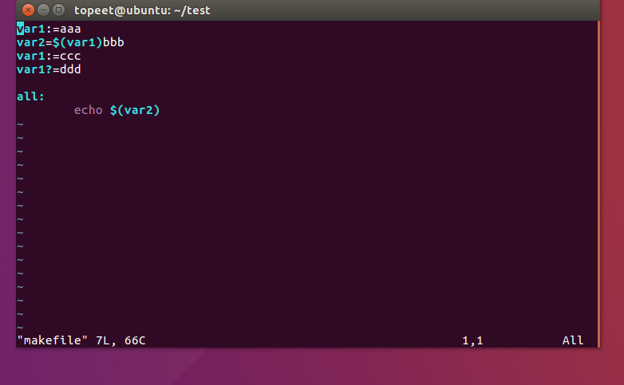


这是一个非常经典的 Makefile 陷阱！

根据你打印出的结果 cccbbb，我可以 99% 确定：**你的 Makefile 代码里，实际上使用的是 =（延时赋值/递归赋值），而不是 :=（立即赋值）。** 或者，你的赋值顺序写反了。

为了让你彻底明白，我们来还原一下“案发现场”。

### 1. 为什么你得到的是 cccbbb？（还原你的代码）

要输出 cccbbb，你的 Makefile 也就是长下面这个样子（**注意看中间那个等号**）：

codeMakefile


```
A = aaa
B = $(A)bbb    # <--- 这里你大概率用的是普通的 = 
A = ccc

all:
	echo $(B)
```

**原因解析（延时赋值 =）：**

- 在 Makefile 中，普通的 **=** 是 **“向后看”** 的。
- 当执行 B = $(A)bbb 时，Make 工具**并没有**立刻把 $(A) 替换成 aaa。它只是记了个笔记：“B 的值是由 A 和 bbb 组成的”。
- 直到最后一行 echo $(B) **真正要用到 B 的时候**，Make 工具才去查看 A 现在到底是多少。
- 此时，A 已经被改成了 ccc。
- 所以，B 最终就被解析成了 cccbbb。

------


### 2. 只有怎样写，才会得到 aaabbb？

如果你想得到 aaabbb，你必须在定义 B 的时候使用 **:=**。

代码应该改成这样：

codeMakefile


```
A = aaa
B := $(A)bbb   # <--- 注意这里必须是 :=
A = ccc

all:
	echo $(B)
```

**原因解析（立即赋值 :=）：**

- **:=** 是 **“活在当下”** 的。
- 当执行 B := $(A)bbb 这一行时，Make 工具会立刻看一眼 A 是多少（此时 A 是 aaa）。
- 它立马把 aaa 填进去，**B 的值就在这一行被死死地固定为 aaabbb 了**。
- 后面你再把 A 改成 ccc 甚至删掉，都跟 B 没关系了。

------


### 3. 第三种可能性（顺序写反了）

当然，还有一种可能，你确实用了 :=，但是你的顺序写成了这样：

codeMakefile


```
A = aaa
A = ccc        # <--- 你先把 A 改成了 ccc
B := $(A)bbb   # <--- 然后才进行立即赋值
```

这时候，因为在赋值的那一瞬间 A 已经是 ccc 了，所以结果也是 cccbbb。

------


### 总结：一图胜千言

为了方便记忆，你可以用 **“看直播”** 和 **“拍照”** 来比喻：

- **= (延时赋值)** 就像 **看直播**。
  不管前面发生了什么，观众（变量 B）看到的永远是主播（变量 A）**当前的最新状态**。主播最后换了件红衣服（变成 ccc），观众看到的就是红衣服。
- **:= (立即赋值)** 就像 **拍照**。
  咔嚓一下拍下来（赋值），画面就被**定格**了。不管主播后面怎么换衣服，照片里的样子永远不会变（保持 aaa）。

**建议：**
你可以用 cat makefile 命令查看一下你文件里的具体内容，确认一下你定义变量 B 的那一行，是不是写成了 = ？

# $符号是什么意思???它后面为什么要加上括号??

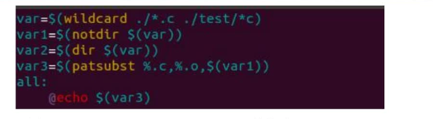

这是一个关于 Makefile 语法最基础、但也最重要的规则。

简单直接的回答：

1. **$ 符号：** 意思是 **“我要取值”** 或者 **“我要调用函数”**。
2. **() 括号：** 意思是 **“划定界限”**，告诉系统变量名或者函数名在哪里开始，在哪里结束。

我们可以把它比作 **“钥匙”** 和 **“盒子”**。

------


### 1. $ 符号：取值的钥匙

在 Makefile 里，如果你直接写一个名字（比如 var），系统会把它当成**普通的字符串文本**。
只有加上 $，系统才知道：“哦！你是想**读出这个变量里面存的内容**”，或者“你是想**运行这个函数**”。

- **var** = 仅仅是三个字母 v, a, r。
- **$(var)** = 取出变量 var 里存放的内容（比如 test1.c）。

**举个生活中的例子：**

- **钱包** = 这只是个物体（变量名）。
- **$(钱包)** = 拿出钱包里的钱（取值）。

------


### 2. 为什么要有 () 括号？为了不认错人

这是 Makefile 一个非常有意思（也很容易坑人）的设定。

**Makefile 的规则是：**
如果 $ 后面没有括号，那么它**只认紧接着的第 1 个字符**作为变量名！

#### 惨痛的对比：

假设你定义了 var = test.c

- **写法 A（正确）：** $(var)
  系统看到括号，知道变量名是 var。
  **结果：** test.c

- **写法 B（错误）：** $var <-- 注意这里没加括号

  系统解析时会这么想：“$ 后面没括号，那变量名肯定只有一个字母。就是 v！”

  所以它会解析成：**$(v)** + **ar**
  如果你的系统里没有定义变量 v（通常是空的），那么最终结果就变成了：**ar**。
  **(原本的 test.c 变成了 ar，程序直接跑挂！**

  **所以，加上** **()** **就是为了把变量名包裹起来，明确告诉系统：“我的名字很长，从左括号开始，到右括号结束，这整个一坨都是我的名字！”**

------


### 3. 结合你的截图来分析

你的截图里混合了两种用法：**“取变量值”** 和 **“调用函数”**。它们的格式都是 $(...)。

#### 第一行：var=$(wildcard ./*.c ...)

- 这里是 **函数调用**。
- $：我要调用函数了！
- wildcard：这是**函数的名字**（通配符函数，用来找文件的）。
- ()：括号里包着的是给函数的**参数**。
- **翻译：** 呼叫 wildcard 函数，参数是那些路径，请把找到的文件名返回给我，并赋值给 var。

#### 第二行：var1=$(notdir $(var))

这里有两层 $：

1. **里层的 $(var)：** 这是 **取变量**。取出上一行找到的文件列表。
2. **外层的 $(notdir ...)：** 这是 **函数调用**。调用 notdir 函数（去掉路径，只留文件名）。

------


### 总结

- **$**：**唤醒符号**。告诉 Make 工具：“嘿，别睡了，这里有个变量要替换，或者有个函数要执行。”
- **(...)**：**边界符号**。告诉 Make 工具：“变量名/函数参数 到此为止”。

**养成好习惯：**
在写 Makefile 时，**无论变量名长短，永远都要加上括号 $(...)**（或者花括号 ${...} 也是可以的），这样能保你平安，永不出错。

# VMwareTools是干嘛的??对于LInux嵌入式开发有什么用??

这也是一个非常实用的问题！如果你是在 Windows 电脑上安装了 VMware 虚拟机来跑 Linux（Ubuntu），那么 **VMware Tools** 简直就是你的**救命稻草**。

没有它，你的虚拟机就是“半残废”状态；有了它，虚拟机才是一个完整的开发环境。

------


### 1. VMware Tools 是什么？

简单来说，它是一套安装在 **Linux 虚拟机内部** 的**驱动程序和增强工具包**。

把它比作**“桥梁”**或**“翻译官”**最合适：它架起了你的 **宿主机**（Host，比如你的 Windows 10）和 **虚拟机**（Guest，比如 Ubuntu）之间的沟通桥梁。

------


### 2. 它有什么具体功能？（没有它你会很痛苦）

如果你**不安装**它，你会遇到以下 4 个超级痛苦的场景：

1. **画面只有一小块：** 无论你怎么最大化窗口，Ubuntu 的桌面永远只有中间那一小块（比如 800x600 分辨率），周围全是黑边。
   - ✅ **装了后：** 分辨率自适应，虚拟机窗口拉多大，Ubuntu 桌面就自动变多大，全屏看起来就像真的 Linux 电脑一样。
2. **鼠标被困住：** 鼠标点进虚拟机就出不来了，想回到 Windows 必须按 Ctrl + Alt 释放鼠标。
   - ✅ **装了后：** 鼠标可以在 Windows 和 Ubuntu 之间丝滑移动，没有任何阻碍。
3. **不能复制粘贴：** 你在 Windows 浏览器搜到一个 Linux 命令，想复制进 Ubuntu 终端？对不起，粘贴不过去。
   - ✅ **装了后：** **剪贴板共享！** Windows 复制，Linux 粘贴；Linux 复制，Windows 粘贴。这对于新手抄代码、抄命令至关重要！
4. **文件传不进去：** Windows 下载的源码包，怎么弄进 Linux？不装工具你只能搞 FTP 或者 U盘挂载，麻烦死。
   - ✅ **装了后：** 直接**拖拽**（Drag and Drop）文件进窗口，或者使用**共享文件夹**。

------


### 3. 对于 Linux 嵌入式开发有什么用？

在嵌入式开发中，VMware Tools 的作用不仅仅是“好用”，而是**“工作流的核心”**。

绝大多数嵌入式工程师的工作模式是这样的：

- **Windows 端：** 看原理图、写文档、用 Source Insight / VS Code 看代码（因为 Windows 下的阅读工具更好用）、聊微信对接需求。
- **Linux 端：** 交叉编译（GCC）、打包固件、烧写程序。

这时候，VMware Tools 的 **“共享文件夹 (Shared Folders)”** 功能就是神技：

#### 场景模拟：

1. 你在 Windows 上设置一个文件夹叫 Code，把它设为“共享文件夹”。
2. 你在 Linux 虚拟机里，这个文件夹会被挂载在 /mnt/hgfs/Code 下。
3. **神奇的事情发生了：**
   - 你在 Windows 上用 VS Code 打开 Code 里的 main.c 修改代码，保存。
   - 你切换到 Linux 终端，进入 /mnt/hgfs/Code，直接执行 make。
   - **文件是实时同步的！**

**如果没有 VMware Tools：**
你得在 Windows 改好 -> 用 FTP 传到 Linux -> Linux 编译 -> 报错 -> 回 Windows 改 -> 再传 FTP... **你会崩溃的。**

------


### 4. 一个小提示：open-vm-tools

现在的 Ubuntu 版本比较新（比如 Ubuntu 18.04/20.04/22.04），官方其实更推荐使用开源版本的工具，叫 **open-vm-tools**。

如果你发现 VMware 菜单里的“安装 VMware Tools”是灰色的，或者装不上，可以直接在 Ubuntu 终端里输入这条命令来安装，效果是一模一样的：

codeBash


```
# 更新软件源
sudo apt update

# 安装开源版工具（支持桌面环境）
sudo apt install open-vm-tools-desktop -y

# 安装完后，重启虚拟机生效
reboot
```

### 总结

- **VMware Tools** = **显卡驱动 + 鼠标驱动 + 剪贴板同步 + 文件共享通道**。
- **对嵌入式开发的意义** = 打通 Windows（编辑代码）和 Linux（编译代码）的**任督二脉**，让你效率翻倍。

**强烈建议：** 装完虚拟机的第一件事，就是把这个装好！

# 嵌入式开发中 什么是上位机??串口助手是不是上位机??

这是一个非常经典的嵌入式概念，也是新手必须建立的“世界观”。

简单直接的回答：

1. **什么是上位机？** 上位机是指**发出指令、控制系统、显示数据、处理复杂逻辑**的那个设备（通常是电脑 PC、手机或服务器）。
2. **串口助手算不算？** **算！** 它是最基础、最通用的上位机软件。

为了让你彻底理解，我们需要引入它的好兄弟——**下位机**。

------


### 一、 核心概念：上位机 vs 下位机

在嵌入式系统中，通常有两个角色在对话：

#### 1. 下位机 (Lower Computer / Slave)

- **角色：** **“干活的士兵”**。
- **是谁：** 单片机（STM32, 51）、嵌入式 Linux 开发板（你的 3863 或 Topeet 板子）、PLC、传感器模块。
- **特点：**
  - 直接连接硬件（电机、灯、传感器）。
  - 资源有限（内存小、CPU 慢）。
  - **只负责执行命令**（你让我开灯我就开灯，你让我读温度我就读温度）。
  - 通常没有屏幕，或者屏幕很简陋。

#### 2. 上位机 (Upper Computer / Host)

- **角色：** **“发号施令的将军”**。
- **是谁：** Windows 电脑、Android 手机、平板、云端服务器。
- **特点：**
  - 计算能力强（算得快）。
  - 界面好看（有漂亮的 UI、曲线图、按钮）。
  - **负责发命令**（告诉下位机什么时候开灯）和**展示结果**（把下位机发回来的温度画成曲线）。

------


### 二、 它们是怎么对话的？

它们之间必须有一根“电话线”连着，这就是**通信协议**。

- **物理连接：** 串口 (UART/USB转串口)、网线 (TCP/IP)、蓝牙、WiFi、CAN 总线。
- **语言：** 比如你约定发 0x01 是开灯，发 0x02 是关灯。

**场景模拟：**

1. **上位机（电脑）** 通过串口发送 0x01。
2. **下位机（开发板）** 收到 0x01，于是给 GPIO 通电，灯亮了。
3. **下位机（开发板）** 返回 0xOK 给电脑。
4. **上位机（电脑）** 屏幕上弹出一个弹窗：“灯已开启”。

------


### 三、 串口助手是不是上位机？

**答案是：它属于“通用的上位机软件”。**

我们可以把上位机软件分为两个档次：

#### 第 1 档：串口助手（通用工具）

- **本质：** 它是用来**调试**的。
- **为什么算上位机？** 因为它完全符合上位机的定义——它能**发指令给板子**，也能**显示板子发回来的数据**。
- **局限性：**
  - 它只能收发原始数据（比如 01 02 03），它看不懂这些数据代表什么。
  - 它没有漂亮的按钮（你只能手敲 01 发送）。
  - 它不能自动把温度数据画成折线图（除非是用带绘图功能的特种助手）。

#### 第 2 档：定制开发的上位机（真正的产品）

- **本质：** 它是**给用户用**的。
- **怎么做的？** 程序员使用 C# (WPF/WinForm)、Qt (C++)、Python (PyQt) 等语言写的一个专门的软件。
- **特点：**
  - 界面上有“开启”、“关闭”按钮，而不是让你输 0x01。
  - 后台会自动解析数据，直接显示“当前水温：35.6℃”。
  - 看起来像个正经的 APP。

------


### 四、 举个你身边的例子

1. **无人机：**
   - **下位机：** 无人机肚子里的飞控电路板（负责控制电机转速、保持平衡）。
   - **上位机：** 你手里的遥控器，或者手机 APP（负责显示电量、地图，发送“向前飞”的指令）。
2. **3D 打印机：**
   - **下位机：** 打印机主板（控制喷头移动、加热）。
   - **上位机：** 电脑上的切片软件（Cura）或控制软件（发送打印指令）。

### 五、 总结

- **上位机**就是那个**发命令、看数据、性能强**的设备（通常指运行在电脑上的软件）。
- **串口助手**是最简陋、最基础的上位机软件，主要给你（开发者）调试用的。
- 当你以后工作时，老板说：“小王，去用 Qt 写个上位机”，他的意思不是让你下载个串口助手，而是让你**写一个带界面的、能控制你板子的 Windows/Linux 桌面软件**。

# Linux嵌入式开发中，SSH是干嘛的??有什么用??

这是一个非常核心的问题！在嵌入式 Linux 开发中，**SSH (Secure Shell)** 是除了串口（Serial/UART）之外，最重要的调试和交互工具。

如果把串口比作“救命稻草”（板子挂了也能看打印信息），那么 **SSH 就是“高速公路”**（开发效率极高）。

------


### 1. SSH 是什么？

简单来说，SSH 是一种**网络协议**。
它允许你通过网络（网线或 WiFi），在你的电脑（PC）上，**远程登录**到你的开发板里，去控制它。

> **形象的比喻：**
> 你坐在电脑前，通过一根无形的网线“灵魂附体”到了开发板上。你在电脑键盘上敲的命令，实际上是在板子里执行的；板子的执行结果，直接显示在你的电脑屏幕上。

------


### 2. 它在嵌入式开发中有什么用？（三大核心功能）

#### 功能一：摆脱屏幕和键盘（Headless 操作）

嵌入式开发板通常没有接显示器，也没接鼠标键盘。

- **没有 SSH 时：** 你可能需要给板子接一套键鼠和屏幕，或者挤在慢吞吞的串口终端里。

- **有了 SSH：** 你只需要把板子插上网线，知道它的 IP 地址。你就可以在电脑的终端里（PowerShell, CMD, 或者 Ubuntu 终端）输入：

  codeBash

  

  ```
  ssh root@192.168.1.100  (假设板子IP是这个)
  ```

  瞬间，你的终端就变成了开发板的终端。

#### 功能二：极速传输文件 (scp 命令)

这是 SSH 最强大的地方！
你在电脑上编译好了程序 myapp，怎么弄到板子里去运行？

- **笨办法：** 拔出板子的 SD 卡 -> 插电脑 -> 复制文件 -> 插回板子 -> 挂载 -> 运行。

- **SSH 办法：** 使用 SSH 协议自带的文件传输工具 scp (Secure Copy)。
  在电脑上执行一条命令：

  codeBash

  

  ```
  # 把电脑当前目录的 myapp 传到板子的 /root 目录下
  scp myapp root@192.168.1.100:/root/
  ```

  **一秒钟搞定，无需拔插卡。**

#### 功能三：多开窗口，效率倍增

如果你只用串口（UART），你通常只能打开一个终端窗口。如果你运行一个程序卡住了（比如 while(1)），你就没法输入其他命令了。

- **SSH 的优势：** 只要网络通，你可以同时开 10 个 SSH 窗口连接同一个板子。
  - 窗口 1：运行主程序，看打印日志。
  - 窗口 2：输入 top 查看 CPU 占用率。
  - 窗口 3：修改配置文件。
  - 窗口 4：监控内存。
    **这对于调试复杂的程序简直是神技。**

------


### 3. SSH 和 串口（UART）有什么区别？

这是新手最容易混淆的。

| 特性         | 串口 (Serial/UART)                  | SSH (Secure Shell)                |
| ------------ | ----------------------------------- | --------------------------------- |
| **连接方式** | 物理线 (USB转串口线)                | 网络 (网线/WiFi)                  |
| **速度**     | 很慢 (115200bps 约为 11KB/s)        | **极快** (100Mbps/1000Mbps)       |
| **传输文件** | 极慢 (用 rz/sz 命令)，容易出错      | **极快** (scp/sftp)，稳定         |
| **多任务**   | 同一时间只能开一个窗口              | **可以同时开无数个窗口**          |
| **稳定性**   | **极高** (内核挂了也能看到最后遗言) | 一般 (系统挂了或网断了就连不上了) |
| **使用阶段** | **刚上电/系统崩溃/烧写系统时**      | **系统启动成功后的日常开发**      |

**总结：**

- **板子起不来的时候**，或者在配置网络之前，必须用**串口**。
- **板子启动进系统后**，为了传文件快、操作方便，大家都会立刻切到 **SSH**。

------


### 4. 实际开发场景模拟

假设你在开发 3863 或 Topeet 的板子：

1. **PC端：** 你写好了代码，用交叉编译 GCC 生成了可执行文件 hello。
2. **传输：** 你不想拔 SD 卡，直接在 PC 终端输入：
   scp hello root@192.168.x.x:/bin/
3. **运行：** 你在 PC 上打开另一个终端，SSH 登录板子：
   ssh root@192.168.x.x
4. **执行：** 在 SSH 里输入 ./hello，程序跑起来了。
5. **调试：** 发现有 Bug，回到步骤 1 修改代码，重复上述过程。

**这就是嵌入式 Linux 工程师每天重复几百次的工作流。**

### 5. 补充：Sftp 是什么？

你之前的截图里出现了 sftp-server。
**SFTP (SSH File Transfer Protocol)** 就是利用 SSH 的**安全通道**来进行文件管理的协议。
你可以用像 **FileZilla** 或 **WinSCP** 这样的图形化软件，输入板子的 IP、账号、密码（默认通常是 SSH 的账号密码），就可以像在 Windows 管理资源管理器一样，**拖拽**管理板子里的文件了。这比命令行 scp 更直观。

# ubuntu系统介绍(讯为电子)


## 问题1:什么是ubuntu?和Linux的关系是什么?

Ubuntu是linux的发行版之一

## 问题2:Linux的发行版有哪些呢?

Ubuntu radhat centos debian openwrt

## 问题3:常见的ubuntu分为哪些?

### Ubuntu分为:

有界面的Ubuntu和没有界面的Ubuntu

没有界面的Ubuntu:Ubuntu-core

有界面的Ubuntu:Ubuntu-desktop工

### Ubuntu的组成:

Ubuntu-core+第三方桌面

Ubuntu-core+gnome=Ubuntu

Ubuntu-core+kde=kubuntu
Ubuntu-core+xde=lubuntu


# ubuntu启用root用户(讯为电子)


## 1 命令行的组成:

topeet:当前操作用户
Ubuntu:代表主机名
~:当前目录名
S:代表不是root用户
#:代表root用户权限

## 2为什么要启用 root 用户?

我们使用 Ubuntu系统主要用来做嵌入式开发，不是linux运维，没有必要对root用户过于敏感。
系统的权限都要为我们嵌入式开发人员打开。

## 3 启用root 用户步骤

### 步骤一:

使用 sudo passwd
然后输入密码

### 步骤二:

su root
输入 root 密码

如果启动成功，则显示当前的用户为root 而不是topeet

## 4 退出 root 用户

使用 exit 命令。


# Ubuntu使用apt-get下载(讯为电子)

## 使用 apt-get 命令之前的检查

### 1.Ubuntu 必须可以上网

打开浏览器

## 2.设置下载源

系统设置里面设置

## 3.更新下载源

apt-get update

## 4.安装 vim 软件

apt-get install vim

## 5.更新软件

apt-get upgrade vim

## 6.卸载软件

apt-get remove vim


# Ubuntu中进入Ubuntu桌面和切换成root用于的密码是不是不一样的??


在典型的 Ubuntu 桌面发行版中，这两个密码通常**不一样**，原因在于二者的账号体系与默认安全策略不同。

## 1. Ubuntu 桌面登录密码

这是你安装系统时为**普通用户账户**设置的密码，例如你的用户名是 `yourname`，你用这个密码登录图形界面 (Ubuntu Desktop)。

Ubuntu 的默认安全模型是：
 用户通过 `sudo` 临时获得管理员权限，而不是直接用 root 登录。

## 2. root 账户的密码

Ubuntu 默认**禁用 root 登录**，具体表现是：

- root 用户存在
- 但 root 的密码被锁定
- 不能直接 `su` 到 root，也无法图形界面登录 root

因此，初始情况下 root 用户是没有可用密码的，不是“密码不同”，而是：
 **root 账号默认没有可用密码，不能直接登录。**

要尝试 `su` 会看到：

```
su -
Password:
su: Authentication failure
```

## 3. 如果你主动给 root 设置密码

你运行

```
sudo passwd root
```

然后设置一个密码，此时：

- **root 有了单独的密码**
- <span style="color:#000000;">**它与桌面用户密码是<span style="color:#000000;">完全独立</span>的，不会自动相同也不会强制不同**</span>
- **root 可以通过 `su -` 登录，也能用于部分系统切换**

换句话说：
 **普通用户密码和 root 密码互不影响，是两个独立账户**。

## 4. 常见场景总结

| 场景                     | 普通用户密码   | root 密码          |
| ------------------------ | -------------- | ------------------ |
| 默认安装后的 Ubuntu      | 有             | 无法使用（被锁定） |
| 使用 sudo passwd root 后 | 有             | 有（你手动设置的） |
| 图形界面登录             | 用普通用户密码 | root 默认不可登录  |

如你需要，我可以帮你检查你当前 Ubuntu 系统的 root 状态，并指导你正确启用 root 或保持更安全的做法。

# 讯为电子课程笔记

# vim编辑器的使用(讯为电子)

## 1.什么是 vim?

vim 是一个文本编辑器，类似于 win 上的 wps。

## 2.为什么要学习 vim?

因为几乎每一个发行版都有 vim/vi 编辑器，嵌入式 Linxu 上通常也会集成 vim。

## 3.vi 和 vim 的关系?

vim 是 vi 的加强版。

## 4.怎么打开 vi 编辑器?

直接在控制台输入命令:vi filename

如果当前路径没有我们要打开的文件，vi会帮我创建一个，如果当前路径有这个文件，则直接打开这个文件

## 5.vi 编辑器三种模式?

一般模式，如下图


编辑模式，如下图所示，可以按键盘上的1从一般模式切换到编辑模式


从编辑模式退回到一般模式，按键盘上的 esc 按键。

命令行模式，按键盘上的:可以切换到命令行模式


举例，在命令行模式输入命令“set number”即可显示行号

如下图:

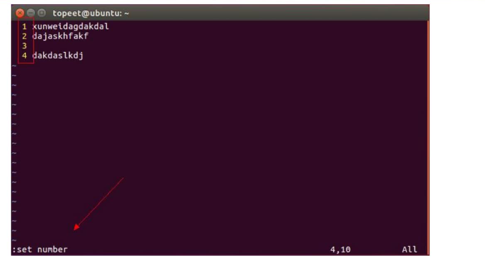

## 6.vim 编辑器移动光标

可以使用键盘上的上下左右按键
KJHL也可以来移动光标
K:向上移动
J:向下移动
H:向左移动
L:向右移动

## 7.vim 编辑器快速定位

gg:将光标定位到第一行

G:将光标定位到最后一行

ngg:将光标定位到底n行

## 8.vim 编辑器的复制

先将光标放在我们要复制内容的行首，使用上下左右按键来选择文字，选择好之后按键盘的上 Y，接着按 esc 回到一般模式，把光标移动到我们要复制的地方，然后按键盘上的 P。

## 9.使用快捷键来复制

先将光标放在我们要复制内容的行首，双击“yy”，然后把光标移动到我们要复制的地方，接着按键盘上的 p。
yy:复制当前行
nyy :复制当前行下的 N 行。

## 10.vim 编辑器的删除命令

方法一:直接进到编辑模式，使用 delete 来删除

方法二:使用 dd 命令。
dd:删除光标所在行。
ndd:删除n行
n1，n2d:删除指定范围的行。需要在命令行模式下操作。

## 11.vim 的撤销

在一般模式下直接按键盘上的“u”，注意，关闭过的文本文件不能再撤销

如果不清楚自己现在在哪个模式，可以使用 esc 按键来回到一般模式

反撤销:ctrl+r

## 12.vim 的查找

使用/进到命令行模式，然后输入我们要查找的字符，查找下一个使用的是“n”使用?进到命令行模式，然后我们输入我们要找到的字符，查找下一个使用的是“n”

## 13.vim 的替换

:%s /old/new/g

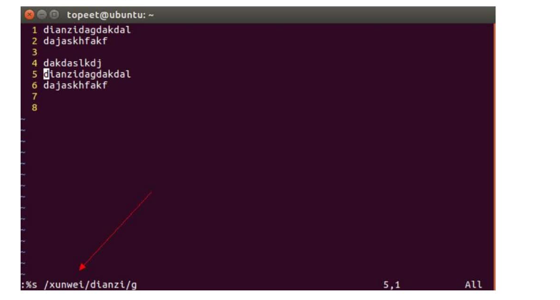

## 14.vim 的保存

:q!强行退出，不保存g!
:wq保存退出
:q 退出没有编辑过的文本

## 15 vim 的文件对比

vimdiff file1 file2 file3

# Linux常用命令第一部分(讯为电子)

## 1.ls 命令:

功能:查看文件信息
Ubuntu 里面以“.”开头的文件为隐藏文件
-a 显示所有文件
-1显示文件的所有信息


第一列参数代表的含义:

代表文件类型
d:表示目录文件

-:表示普通文件
P:管理文件

l:链接文件

b :块设备文件

C:字符设备文件

S:套接字文件


文件权限:

r:表示读权限

W :表示写权限

X:可执行权限

-:没有权限
:当前目录
:上一级目录


第一个是用户名 第二个是组名

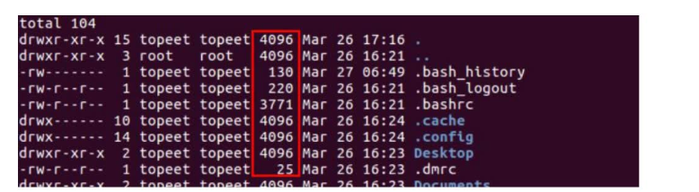

表示文件大小单位：字节


文件最后修改日期

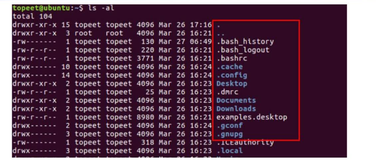

文件名

2 cd 命令
使用 cd 命令改变工作目录

cd .. 作用:返回上一级目录
3 pwd 命令

查看当前所处的路径

# Linux相对路径和绝对路径(讯为电子)

## 什么是绝对路径?

概念:目标位置的完整路径。
绝对路径都是从根目录开始，Linux的根目录是/
举例:
北京海淀区
/地球/中国/北京市/海淀区/复兴路/100 号

## 什么是相对路径?

概念:目标路径是相对于你当前所在位置为基准的路径相对路径一般都是以./开头的
举例:
我现在在北京
相对路径表示:./海淀区/复兴路/100号

# Linux家目录和根目录概念

## 什么是根目录?

根目录是 Linux 中最底层的目录，用“/”表示

## 什么是家目录?

当前用户所在路径 用“~”表示。
root 用户的家目录与普通用户的家目录不一样，普通用户的家目录实在/home 路径下root 用户的家目录实在/root 路径下

# Linux常用命令第二部分

## 1.mkdir 命令

功能:创建一个新的文件夹

mkdir test 创建一个名为 test 的文件夹

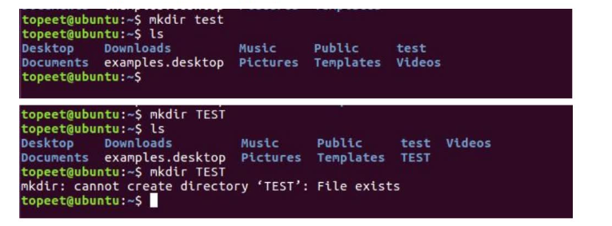


注意:linux 下是区分大小写的
同一级目录下不能创建文件夹名字一样的文件


使用-p 参数 可以创建多级目录

## 2.rmdir

功能:删除一个非空目录


rmdir test 删除 test 文件夹
注意:这个命令只能删除非空目录

## 3.rm 命令

功能:删除文件或者目录

-r -f-i

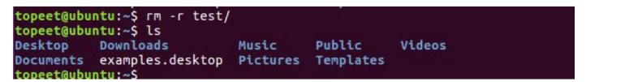

rm -r test **递归删除**这个目录下所有的子目录

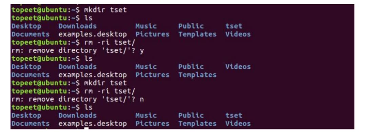

注意 删除目录一定要加上**-r** 参数

## 4.touch 命令

功能:创建一个文件


touch test.c 创建一个c文件
rm test.c

## 5.clear 命令

功能:刷新屏幕，但是会保留历史记录

## 6.reset 命令

功能:重新初始化屏幕。历史记录也会清除

## 7.cp 命令

功能:复制文件或者复制目录
命令格式:cp 源文件 目标文件


cp test1.c test2.c 复制一个和 test1.c 一模一样的 test2.c 文件


使用-r 参数 **递归复制**


把文件复制到我们想要复制的目录 我们使用 cp test1.c. 就可以了

格式:cp 源文件 路径
sudo 使用管理员权限来运行


cp 源目录 路径

## 8.mv 命令

功能:修改文件名 修改目录的命令 移动文件
修改文件名

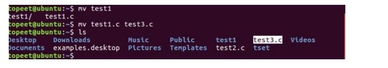

格式:mv 源文件名 想改成的文件名

修改目录名:


格式:mv 源目录 想改成目录名

移动文件:

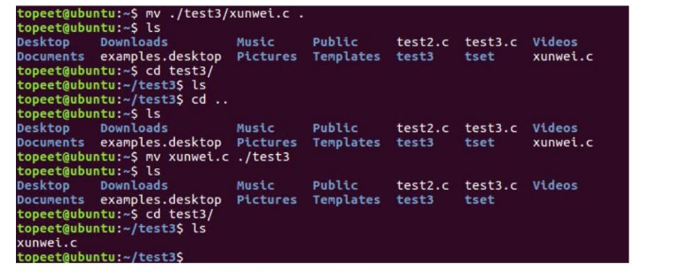

格式:mv 想要移动的文件的路径 要移动到哪里


表示任意移动多个文件我们的可以通配符“*” .” *“表示任意

## 9 tar 压缩和解压命令

功能:对文件和目录进行打包
格式:tar[参数]压缩文件名要压缩的目录或者文件的名字

-x:对打包文件进行解压缩
-z: **gzip 格式**进行压缩或者解压，如果**c**结合，就是**压缩**，如果与**x**结合，就是**解压缩**。后缀 tar.gz
-j:以 **bzip2 的格式**进行压缩或者解压，如果**c**结合，就是**压缩**，如果与**x**结合。就是**解压缩**。后缀 tar.bz2
-f:表示**要操作的文件**，一般放在所有参数最后面
-v:显示正在处理的文件
-C:格式-C 路径，表示将压缩文件解压到指定路径

例子:
以 bzip2 的格式压缩文件


以 gzip 的方式解压和压缩文件

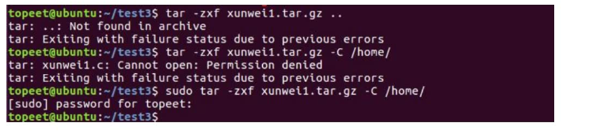

## 10 ifconfig

功能:查看和配置网络状态

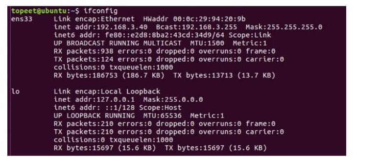

设置 IP 地址
格式:ifconfig 网卡 IP


ifconfig 网卡名称 down

功能:关闭网卡


ifconfig 网卡名称 up
功能:打开网卡

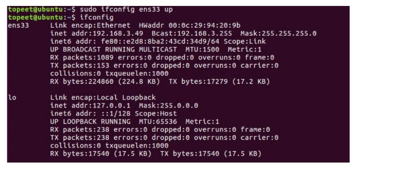

## 11 cat 命令

功能:查看文件的**内容**
-b 对输出的行进行一个行编号


## 12 reboot 命令

功能:重启系统

## 13 poweroff 命令

功能:关闭系统

## 14 ipconfig 命令

功能:查看 **win 电脑**的 IP


## 15 ping 命令

功能:可以测试本机与目标机器的网络是否联通 速度如何 稳定性如何。
-c ping 指定次数后停止。
目标机器可以是IP 也可是域名，如果是域名，要保证 dns 是正确的

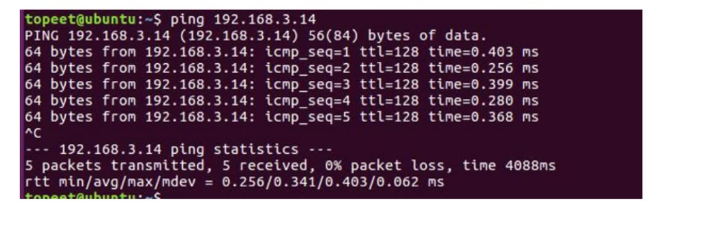

# Linux帮助手册讲解

## 1.Linux 帮助手册

使用 man 命令打开，使用手册一共有九页。


1.可执行的程序或者 shell 命令

2.系统调用
3.库调用
4.设备和特殊文件的帮助，通常在/dev 下面
5.配置文件的帮助
6.游戏的帮助
7.杂项的帮助
8.超级用户可以执行的系统命令的帮助
9.内核相关的。

## 2.使用 man 手册之前我们需要先安装下依赖

使用命令 apt-get install manpages-posix-dev

## 3.如果我们不知道我们要查找的命令在第几页，我们可以使用-f参数，这个参数可以查看命令拥有哪个级别的帮助

# Linux权限管理

## 1.为什么要管理 Linux 权限?

很好管理每个用户。控制每个用户对系统权限的访问。

初次创建的用户要比普通用户有更多的权限。

Ubuntu 的用户分为3类:
1:root(超级用户)
2:系统初次创建的用户，比如 topeet
3:安装完系统之后创建的用户，
用户的信息全部被保存在/etc/passwd 文件里面

2.Ubuntu 的文件权限:

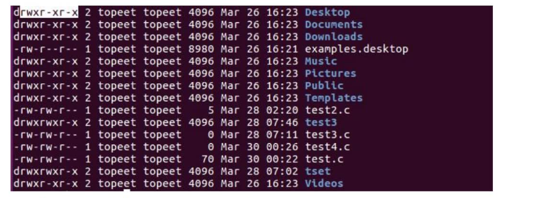

9 个英文字符划分为三组，每三个字母为一组。


第一组:rw- **文件拥有者**的权限 toppet 用户对 myfile 有rw 权限，没有执行权限。

第二组:rw-**文件拥有者所在用户组**的权限 与 topeet 文件拥有者所在 topeet 组的用户可以读写，但是不能执行。

第三组:r--其他用户的权限 不予文件拥有者在同一个组的用户权限是只能读，不能写和执行
第三列:topeet代表文件拥有者
第四列:topeet 文件拥有者所在的组
文件的权限不仅可以使用字母来表示，也可以使用二进制来表示

r:1004
w:0102
x:001
第一种组合:--- 000 0
第二种组合:--x 001 1
第三种组合:r-- 100 4

第四种组合:-w- 010 2

第五种组合:-wx 011 3

第六种组合:r-x 101 5
第七种组合:rw- 110 6
第八种组合:rwx 111 7

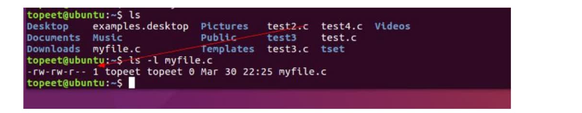

rw- 	6 	4+2=6
rw- 	6 	4+2=6

r-- 	  4 	4+0+0=4

# Linux连接档概念

## 1.Linux 下的连接档种类

一个是类似于 win 电脑的快捷方式，我们称为软连接，一种是通过文件系统的inode 连接来产生的，类似于 win 电脑的复制，但是不产生新的文件，我们称为硬连接。

## 2.什么是 inode?

inode 是用来存放文件信息的，每个文件都会占用一个 inode，并且这个 inode 号是唯一的，文件的内容都是 inode 来指定的，而不是文件名，当系统要访问文件时，inode 就会被复制到内存，从而实现文件的快速访问，使用 ls-i命令则可以看到 inode号 -i参数为打印文件的 inode 号


## 3.什么是硬连接

硬连接只是一个新的链接到某个 inode 号码的记录而已。这个链接指向inode，系统并不给他重新分配 inode。
可以用 In 命令来建立硬连接。
格式:In 源文件 目标文件
常用参数 -f 无论目标文件是否存在都要创建连接。
举例:

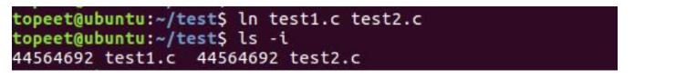

在例子中我们可以发现 test1.c和 test2.c他们的 inode 号码都是 44564692。因为inode 号一样，所有这个俩个文件的权限和属性也是一模一样的，也是 test1.c和 test2.c是俩个完全一样的文件。


连接数也由1变成了 2，这个代表的是有多少个档名链接到了这个 inode 号。


我们在创建一个硬连接。使用In test1.c tset3.c命令后，则会发现我们这个连接数从
2 变成了 3


## 4.使用硬连接的优缺点是什么?

优点:
第一个方便，虽然类似于 win 的复制，但是通常并不占用实际空间。而且不管我们是修改 test1.c或者是修改 test2.c还是 test3.c，只要修改一个，我们的文件就会被同时修改，因为他们的 inode 号都是相同的。
举例:
我们修改 test3.c的内容为如下图所示:


test1.c和 test2.c的内容也被修改成了 nihao，如下图所示


第二是安全，防止误删除，我们删除 test1.c或者是 test2.c或 test3.c 任意一个，我们还是可以通过剩下的连接来访问文件。除非都删掉。
举例:
我们删掉 test1.c。但是 test2.c或 test3.c还是可以访问到“nihao”这个内容。

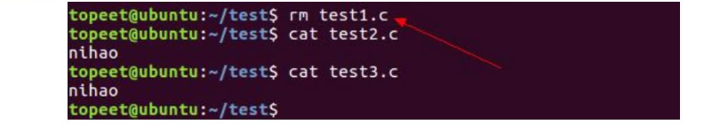

缺点:
只能在同一个文件系统才可以创建硬连接(因为不同的文件系统管理方式不同)，并且目录之间不能创建硬连接。(太复杂，现在还不支持)

## 5.什么是软连接

这个就比较好理解了，类似 win 上的快捷方式。可以用 In 命令来建立软连接。格式:In -s 源文件 目标文件(必须加上-s 参数，使用 In 如果不加任何参数的话，那么就是 Hard Link，而且源文件要用绝对路径)-s 为创建一个软连接


举例：


上图中我们可以发现 test1.c和 test2.c的inode 号是不一样的，所以这个俩个文件是完全独立的，总之软连接就是创立了一个新的文件，当访问这个连接文件的时候，系统就会发现他是一个连接文件，然后读取连接文件找到真正要访问的文件。
因为类似于 win 的快捷方式，我们删掉源文件 test2.c,test1 就不能打开了，如下图所
红色背景代表无效。


软连接虽然没有硬链接安全，但是限制少，所以使用范围还是很广泛的

## 延申内容:

ubuntu 系统中各个文件的颜色含义:
蓝 色:文件夹，Is-或I时可以看到权限部分的第1个字母是 d
红色:压缩文件
绿色:可执行文件
白色:文本文件
红色闪烁:错误的符号链接
淡蓝色:符号链接
黄色:设备文件
灰色:其它文件

# Linux目录结构讲解

## 1.Linux 目录结构

Linux 整个文件系统是从/目录开始

## 2.Linux 文件层次标准

为了解决不同的开发人员之间不统一的问题，文件层次标准简称 FHS，全称 filesystemhierarch standard
FHS 定义了俩层规范:/目录下面应该要放什么文件，比如/etc 下面就应该放配置文件第二层规范是针对 Linux 下/usr 和/var 这俩个目录的子目录来定义的。比如/usr/share 下面就应该放共享数据文件

## 3 Linux 根目录下各个文件的规定

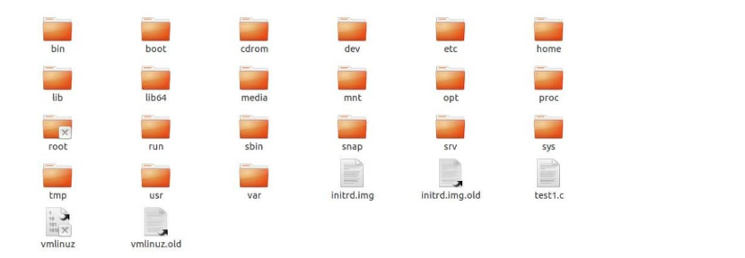

bin:系统启动时需要的可执行命令，大部分普通用户只有可执行权限，没有读写权限，只有root 用户有读写权限
boot:用来存放 BootLoader 相关文件，千万不要乱动，否则无法进入系统

cdrom:光盘目录
dev:设备驱动文件夹
etc:系统配置文件夹，这个文件夹的权限很高，只有root 用户才可以修改这个文件夹

home:家目录，普通用户都有一个以自己名字命名的文件夹存放在这个目录里面lib:各种程序所需要的库文件和系统可以正常运行的支持文件都放在这个文件夹里面

lib64: 64 位支持库
media:用来存放媒体信息的文件
mnt:可以把设备挂载在这个文件夹下，比如U盘

opt:用来存放第三方文件
proc:存放系统信息和进程信息
root:root 用户的家目录
run:保存了系统从最开始到现在的系统信息

sbin:存放系统管理员的可执行命令，里面也是二进制文件

snap:snap 应用程序框架的程序文件
srv:用来存放系统存储服务相关数据sys:系统的设备和文件层次信息。
temp:存放临时文件
usr:存放和用户有关的文件
var:存放一直在变化的文件

# Linux文件系统概念

## 1.什么是文件系统?

操作系统中负责管理和存储文件系统的软件称为文件系统

## 2.Linux 为什么需要文件系统?

Linxu 系统必须要挂载一个文件系统，如果系统不能从指定的设备挂载，系统就会出

## 3.Linux 常见文件系统的类型都有哪些?

ext3，ext4，proc文件系统，sysfs文件系统。

## 4.Ubuntu 的文件系统的类型是什么?

可以用 df 命令查看
功能:df命令可以显示磁盘分区上的可以使用的磁盘空间

使用 df -T 可以显示文件系统的类型

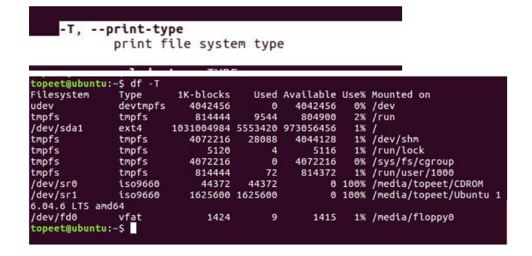

df -Th,以人们更容易读的方式显示

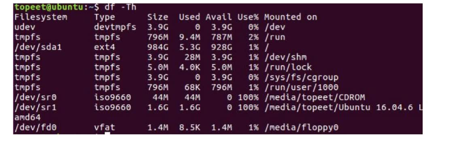


# Linux第一个程序HelloWorld

## 1.什么是 gcc?

gcc 全称(gun compiler collection)既编译套件，gcc 可以支持多种计算机体系结构，比如 X86，MIPI，ARM。Ubuntu默认自带 gcc

可以使用 gcc -v 命令来査看 Ubuntu 的 gcc


## 2.gcc 基本用法

gcc 选项 文件名
举例:gcc hello.c -o hello	-0 参数为指定生成文件的名字

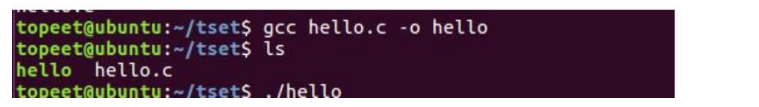

输入./hello 运行 hello 文件，./的意思为在当前目录找我们的 hello 文件并执行。


​	如果我们不使用-0 参数指定我们生成文件的名称，直接输入 gcc hello.c 编译完会得到一个 a.out 文件，执行这个 a.out 的结构和执行 hello 是一样的。

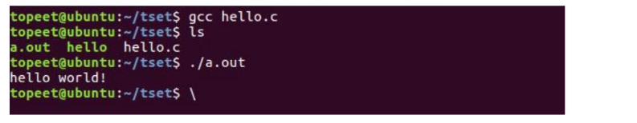

file 命令:
功能:查看文件类型

格式:file 文件名


是用 gcc 编译器编译出来的可执行文件是X86 的，不能再 arm 开发板上运行。可以使用 file 命令来查看文件类型。

## 3.了解编译细节

初学阶段只需要了解这个流程，不用过多的研究
	从 hello.c编译得到 helo 或者 a.out 要经历四个步骤，预处理，编译，汇编，链接。

hello.i 预处理得到的 C 语言代码
hello.s 汇编语言文件
Hello.o 目标文件。
第一个阶段:预处理阶段，编译器会对头文件或者宏定义进行展开，或者条件编译的选择

我们可以使用-E参数得到预处理文件
-E:只对文件行预处理，不编译和链接

使用 gcc -E hello.c-o hello.i 得到预处理后的文件


第二阶段，编译，把文件编译成汇编代码
-S 参数 将 hello.i文件编译成 hello.s 文件

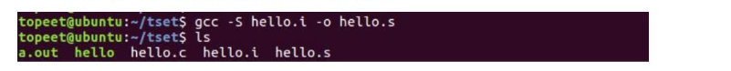

第三阶段，汇编，把汇编文件编译机器码

-c参数 可以把 hello.s 文件编译成 hello.o 文件


第四阶段，链接
直接把目标文件编译成可以执行的文件

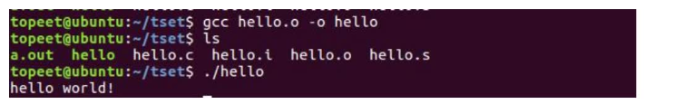

链接分为静态链接和动态链接，gcc 默认的是动态链接

特点:生成的程序下，但是需要依赖库
静态链接:使用-static 参数就是静态链接，因为程序里面包含了需要的库，所以体积比较大


# Linux环境变量讲解


## 1.什么是环境变量?

概念:环境变量是系统预设置的参数。Linux是一个多用户的操作系统，所以每一个用户也都有自己的环境变量
举例:比如我们之前学习的命令我们不管在哪个路径下输入，都是可以执行成功的，因为系统已经把命令的搜索路径提前设置好了

## 2.常用变量 PATH

这个变量决定了要去那个路径下去寻找我们的程序或者命令，而且在以后的开发过程中，我们要经常修改这个变量
echo 命令
功能:在标准输出上显示一段文字


##  3.怎么修改 Ubuntu 的环境变量?

这里给大家介绍最常用的俩种方法。

举例:把/home/topeet/test 路径加到 PATH 变量里面去

第一种方法:直接使用命令设置

命令格式:export 变量=新增的变量值:$变量

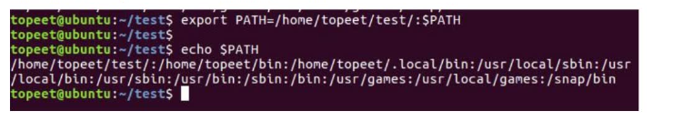

使用这个方法环境变量是立刻生效的，但是只是临时改变，我们重新打开在关闭终端就没有了，而且只对当前用户生效。

第二种方法:修改.bashrc 文件。
我们直接在这个配置文件的最低行加上我们的环境变量。


我们在配置文件的最低行加入我们增加的环境变量。

命令格式:export 变量=新增的变量值:$变量
设置完不是立刻生效的，要使用命令 source.bashrc 更新一下。或者从新打开关闭终端也可以生效。
修改这个文件是永久有效的，但是也是仅对当前用户有效


# Linux编写第一个自己的命令

## 1.什么是命令?

命令就是可执行程序。
比如 Is -al 命令
Is 就是程序的名字 al 就是参数
ps 命令:
功能:显示进程的动态。

2.定义一个自己的命令


# Linux工具之make工具和makefile文件

## 1.什么是 make 工具?

编译辅助工具。解决使用命令编译工程非常繁琐的问题。

## 2.怎么调用 make 工具?

直接在控制台输入 make 命令，就会调用 make 工具。

## 3.什么是 makefile?

makefile 就是描述了整个工程编译连接等规则的文件。makefile 的命令必须是 makefile或者 Makefile

# makefile基本语法(上)

## 设置 vim 首行缩进

vi /ete/vim/vimrc	(rc 结尾的一般为配置文件)

输入 set tabstop=4，保存后退出即可。便发现 vim 打开后的缩进变成4个空格了

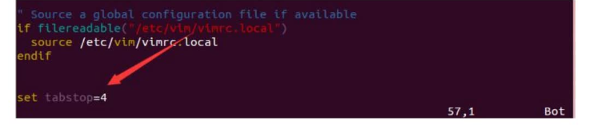

## Makefile 基本语法

语法格式:

目标:依赖
(tab)命令
举例:


目标:all
依赖:空
命令:gcc hello.c -o hello
上面的例子也可以写成:


日标:all 和hello.0
依赖:hello.o和hello.c
命令:gcc hello.c -o hello和gcc -c hello.c
因为 all依赖 hello.o文件，所以要先执行 gcc -c hello.c得到 hello.o文件，然后才可以执行 gcc hello.c -o  hello。所以输入 make 命今后执行顺序如下


在编译的时候，我们可以使用 make 目标来编译，如果我们**不指定目标**的话，默认执行的是**第一个目标**所对应的规则。也就是说make 和 make all 是一样的。如上面的例子。

接下来，我们使用 make 目标的方法来编译。我们修改makefile 代码如下:

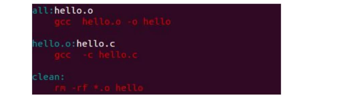

然后我们输入命令 make clean 就可以直接执行 rm -rf  *.o hello 命令。如下图所示:


但是，我们在当前目录下不能有和 makfile目标名一样的文件。比如我在当前日录下创建一个名为clean 的文件，然后在执行make clean 命令就会报错。如下图所示:


为了解决这个问题，makfile引入了一个新的概念，叫做**伪目标**，我们使用伪目标来声明clean就可以避免与当前目录下的同名文件发生冲突。
伪目标格式:
**.PHONY:目标**
所以，我们可以把上面的代码修改成如下图所示:


然后我们在执行 make clean 命令。尽管当前目录下有 clean 同名文件，make clean 命令也可以执行成
功。如下图所示:


## .Makefile 变量和变量赋值

变量可以许多地方使用，比如目标，依赖，或者命令.。

变量的赋值可以使用: = ? = : = +=
变量的使用:通过$()来完成变量的引用。

示例 1:
使用:=来赋值


使用:=来给变量赋值，是立刻赋值，在执行 var:=aaa的同时变量值已经被确定了，所以最后打印为
aaabbb，而不是cccbbb


示例 3:
使用?=来赋值

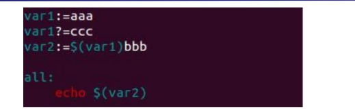


使用?=来赋值的意思为，如果 var1 变量前面没有被赋值，那么就给他赋值为ccc，如果前面已经赋值如下图所示。就使用前面的值，所以，打印为aaabbb，而不是cccbbb，如下图所示。

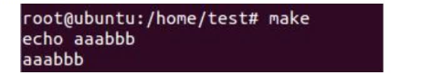

然后我们注释掉第一行代码，makefile种的注释为#


在运行就会打印cccbbb，因为前面没有给var1 变量赋值。如下图所示

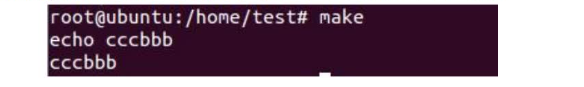

示例 4:使用+=来赋值


使用+=来赋值是追加赋值，是在我们前面定义的好的字符串里面在添加进去新的字符串，所以运行会打印aaa bbbccc。不过中间会有空格，如下图所示;


使用+=也类似与我们这样赋值，如下图所示:


如果赋值很长，我们也可以使用换行符/，如下图所示


## 四.自动化变量

这里介绍三个最常用的自动化变量:

$^:表示所有依赖。
在了解这个三个自动化变量之前，我们先来写一个程序:
main.c


hello.c

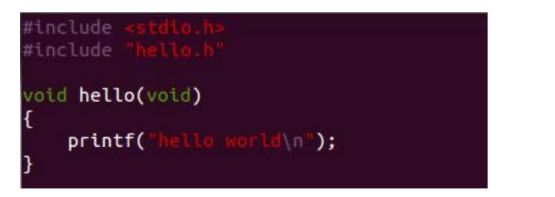

hello. h

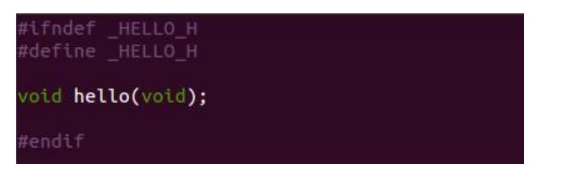

Makefile

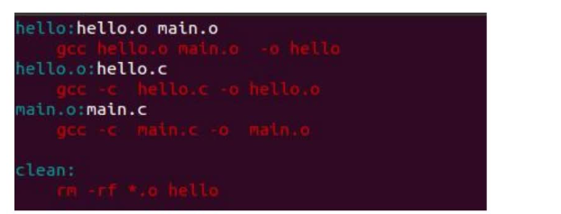

使用这个 makefile 虽然也可以成功编译，但是，一旦编译的文件多了，如果我们还这样来编写makfile 就会变得非常的复杂。所以，自动化变量就排上用场啦。

接下来我们一步一步的来简化我这个 makefile。

简化一:用变量表示依赖文件


后面如果我们在增加依赖文件的话，我们直接在变量 var 后面增加就可以了。
简化二:
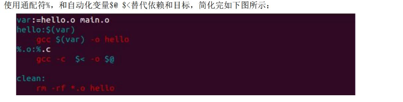

简化三:使用自动化变量$^表示所有依赖，简化完如下图所示:


# makefile基本语法(下)

## 1.wildcard 函数

格式:$(wildcard PATTENR)
功能:展开指定的目录
举例:
在/home/test 目录有一个 a.c的c文件和一个 test 的文件夹，在/home/test/test 文件夹下有一个 b.c的文件。


我们在当前目录下创建的 makefile 里面写下如下代码，echo 前面加了@符号，echo 这
个命令就不显示:


执行结果:


我们得到了./a.c和./test/b.c ，所以 wildcard 函数会把我们指定的./和./test/目录下的c文件展开。

## 2.notdir 函数

格式:*$（notdir*$（var））
功能:去掉路径。
举例:
我们在上面的 makefile 中加上以下代码，因为上面的例子我们得到结果是./a.c和./test/b.c 是有路径的，我们可以直接使用这个变量。


执行结果:


## 3. dir 函数

因为 notdir 函数可以去掉路径，所以/a.c和,/test/b.c 去掉路径就得到了 a.c和 b.c## dir 函数

格式:$(dir <names...>)
功能:取出目录，这里的目录指的是最后一个反斜杠/之前的部分，如果没有反斜杠/就返回当前。
举例:
我们在上面的例子中加入以下代码，如下图所示:


因为 var2 的值为./a.c和./test/b.c，所以取出目录就是./和./test，如下图所示


4. patsubst 函数
    格式:$(patsubst 原文件,目标文件,文件列表)
    功能:替换文件后缀
    举例
    我们在上面的例子中加入以下代码，如下图所示

  

  替换我们可以使用这个函数，也可以使用$(var:a=b)这个格式来替换，我们来改一下上面的代码，

  如下图所示:

  运行结果如下:

  

  ## 5.foreach 函数

  格式:$(foreach <var>,<list>,<text>)

  功能:把参数<list>中的单词逐一取出放到参数<var>所指定的变量中，然后再执行<text>所包含的表达式。每一次<text>会返回一个字符串
  举例:

  

  因为 var2 变量的值为./和./test，所以先把./取出来放在n变量，然后在执行 wildcard 函数取出./和./test 下面的c文件的路径。所以执行结果如下图所示:

  

  


# 开发板固件烧录

## 步骤一：

搞清楚手里的开发板是 EMMC 还是 NAND FLASH


## 步骤二：

从光盘资料里面把下载器拷贝到电脑上，然后进到这个路径下。
拷贝完成如下：图中为 EMMC 版本的镜像。

然后打开 exe 文件。注意，一定要把镜像都放进去，不然打不开。


## 步骤三:

给开发板设置成 USB 串行模式，然后连接 OTG 线，注意尽量不要接到 hub，可能电流
不够导致开发板烧写失败。


烧写成功以后下载器变成绿色。


## 步骤四：

设置开发板的启动方式，设置为 EMMC 或者 NAND 启动，然后设置屏幕的环境变量，
如果没有屏幕，则不用设置。
查看环境变量：在 uboot 模式下输入 pri。
进入 uboot 模式在倒计时的时候立刻敲回车，否则就进到了文件系统模式。


# 借助U盘或者TF卡拷贝到程序到开发板

## 步骤一：

保证 U 盘或者 TF 的格式为 FAT32 格式，TF 卡要用读卡器和电脑连接。

## 步骤二：

把 U 盘或者 TF 卡连接到 VM 软件上，然后使用 df 命令确定挂载的路径。

## 步骤三：

把 U 盘或者 TF 卡连接到开发板，TF 使用读卡器和开发板连接。
使用 df 命令查看一下文件系统是不是自动挂载的 U 盘或者 TF 卡。
如果不是自动挂载的，我们要使用 mount 命令来挂载一下。
mount 命令格式：
mount 设备名称 挂载点
mount /dev/sda1 /mnt
	设备名称可以通过打印信息来确定，如果插上以后没有打印信息，我们可以使用命令来查
看一下分区信息。命令如下：
cat /proc/partitions
	如果是自动挂载的，则不用使用 mount 命令，直接访问挂载的路径就可以了。
卸载命令：umount 命令
格式：umount 挂载点


# nfs服务器的搭建和使用

## 一．什么是 NFS

​	NFS 是 Network File System 的缩写，它可以通过网络，让不同的机器、不同的操作系
统可以共享彼此的文件。
​	NFS 服务器可以让 PC 将网络中的 NFS 服务器共享的目录挂载到本地端的文件系统中，
而在本地端的系统中来看，那个远程主机的目录就好像是自己的一个磁盘分区一样，在使用上
相当便利；


类比之前讲的 samba：
	Ubuntu 安装 samba 与 windows 电脑共享了一个文件夹。Windows 可以直接访问这个
文件夹把 ubuntu 里面的文件拖出来，ubuntu 也可以直接访问这个文件夹把 Windows 电脑
上的文件拖出来。
	samba 共享的文件夹可以类比成 nfs 共享的文件夹/home/nfs。
	nfs 服务器可以类比成 ubuntu
	开发板可以类比成 Windows
	所以使用 nfs 服务器就轻松实现开发板和 ubuntu 之间互传文件。

## 二．同一个网段概念

​	使用 nfs 之前，开发板，虚拟机 ubuntu，Windows 电脑三者要互相 ping 通，这就涉
及到了同一个网段的概念。
​	概念：同一个网段是指 IP 地址和子网掩码相与得到的相同的网络地址。
快速判断同一个网段：
​	（1）开发板，虚拟机 ubuntu，Windows 子网掩码是不是相同
​	（2）开发板，虚拟机 ubuntu，Windows IP 地址的前三段是不是相同。
举例：
Ubuntu ：


​	由上图可知，ubuntu 的 IP 为 192.168.3.22 ，子网掩码是 255.255.255.0
Windows：


​	由上图可知，Windows 电脑的 IP 为 192.168.3.11，子网掩码是 255.255.255.0
​	所以，ubuntu 和 Windows 在同一个网段，因为子网掩码相同，都是 255.255.255.0，
IP 地址前三段相同，都是 192.168.3。

## 三．开发板，Windows，虚拟机 ubuntu 三者之间的连接

（1）虚拟机 ubuntu 要使用桥接模式，不能使用其他模式
（2）开发板使用无线或者有线连接到路由器上，不能直接连接到电脑，不能连接手机热点。
（3）Windows 关闭防火墙，使用有线或者无线连接到和开发板连接的同一个路由器上
（4）如果 Windows 使用的是无线连接到路由器，那么虚拟机 vm 要桥接到无线网卡，反
之，桥接到有线网卡。
（5）保证虚拟机 ubuntu，Windows，开发板在同一个网段。
（6）使用以上连接方法极大减少 ping 不通的概率。如果 ping 不通，请检查以上 5 条是否全
部满足。

## 四．NFS 服务器的搭建

（1）在 ubuntu 安装 nfs 服务：

`apt-get install nfs-kernel-server`

（2）在/home 下创建一个名为 nfs 的文件夹
（3）打开配置文件添加 nfs 共享目录
`vi /etc/exports`
在配置文件里面添加一下代码：
``/home/nfs/ *(rw,sync,no_root_squash)``
其中：/home/nfs/ 是 nfs 服务器要共享的目录
	rw：是可读写权限
	sync：是资料同步写入内存和硬盘
	no_root_squash：当登录 NFS 主机使用共享目录的使用者是 root 时，其权限将被转
换成为匿名使用者，通常它的 UID 与 GID 都会变成 nobody 身份。

（4）重启 nfs 服务
`/etc/init.d/nfs-kernel-server restart`

五.nfs 服务器的使用
（1）开发板烧写 yocto 文件系统
（2）给开发板联网，我使用的是开发板的无线模块连接到路由器上。我们在串口输入以下命
令
`wpa_passphrase 2701 "topeet2015" >> /etc/wpa_supplicant.conf`
生成 wpa_supplicant.conf 配置文件，命令中的“2701” 是无线网络的名字，
“topeet2015” 是无线网络的密码
（3）在调试串口输入以下命令来连接 wifi 网络
`wpa_supplicant -Dnl80211 -iwlan0 -c /etc/wpa_supplicant.conf -dd >/var/wifi_log &`
（4）输入“udhcpc -i wlan0 &” 命令， 通过 dhcp 给 wlan0 分配 ip 地址
（5）使用 ifconfig 命令就可以看我 wlan0 的网络信息了，检查是否在同一个网段，以及能不
能 ping 通 ubuntu。如下图所示：


（6）挂载 nfs 服务器共享的目录，命令如下：
`mount -t nfs -o nolock,nfsvers=3,vers=3 192.168.3.49:/home/nfs /mnt/`
这句代码的意思是使用 nfs3 版本挂载 IP 为 192.168.3.49 中的/home/nfs 到 mnt 文件
夹下，IP 为 ubuntu 的 IP。
挂载成功就可以愉快的传文件了。


# 点亮第一个led灯

之前我们已经写了一个程序 hello world，但是学 linux，单片机的第一个操作硬件就是
点亮一个 led 灯。
在单片机上我们点亮一个 led 灯非常的简单，直接操作引脚就可以了。虽然 Linux 听着
比较高大上，但是点亮一个 led 灯是非常容易的。我们甚至不用去写驱动，直接用命令操作就
可以了，因为 linux 系统本身有好多成熟的驱动框架，使用这些框架的好处就是当我们更换平
台的时候，比如更换到 RK3399 平台，我们应用程序可以不用做任何改变，就可以直接在新的
平台上运行。对于 led 设备，linux 提供的是 led 子系统框架。

## 一.前置知识：

1.怎么控制 led 灯的亮灭？
以 IMX6ULL 终结者开发板为例，原理图如下，我们给管脚 GPIO_3 低电平，电路导通，
led2 亮，给 GPIO_3 高电平，电路不导通，led2 灭。R80 为限流电阻，保护 led 灯不被烧
毁。


2.echo > 重定向命令
举例：
echo hello > test.txt
将字符串输出重定向，当前目录没有 test.txt，则创建 test.txt，并将字符串输出到
test.txt 文件中。和直接使用 vi 编辑器打开 test.txt 然后输入 hello 的效果是一样的。


## 二．Led 子系统的使用

​	我们在超级终端上使用命令“cd /sys/class/leds/”即可进到被 led 子系统所展现的设备
下。在这个目录下面都是以 led 设备命令的设备。其中 sys-led 就是我们要操作的用户灯，对
应底板的 led2。

	然后我们进到 sys-led 这个具体的设备下面。如下图，在这个图中，我们需要关心
“brightness”，“trigger”这个几个参数，分别对应亮度，触发方式。


​	开发板上的 led2 默认的触发方式是 heartbeat，我们可以使用 cat 命令来查看，用“[]”
圈出来的则为当前的触发方式。

	我们使用命令“echo none > trigger”可以把触发方式设置成没有触发，led2 也就熄灭
了。

	点亮 led2 我们只需要设置 brightness 参数就可以了，设置为 1，则打开 led2，设置为
0，则关闭 led2 。
	打开 led2：
`echo 1 > /sys/class/leds/sys-led/brightness`
	关闭 led2：
`echo 0 > /sys/class/leds/sys-led/brightness`

## 三．使用 c 语言调用 shell 命令控制 led 灯

​	用命令来控制 led 灯没有感觉，那可以不可以使用程序来控制呢，让程序帮我们输入这些
命令，我们可以使用 system 函数来完成。
`头文件：＃include<stdlib.h>
格式：system(要执行的命令)`
代码实现：
#include <stdio.h>
void main(void)
{ 
​	system("echo none > /sys/class/leds/sys-led/trigger");//设置触发方式
​	while(1)
​	{
​		system("echo 1 > /sys/class/leds/sys-led/brightness ");//点亮 led2
​		sleep(5);
​		system("echo 0 > /sys/class/leds/sys-led/brightness ");//关闭 led2
​		sleep(5);
​	}
}
